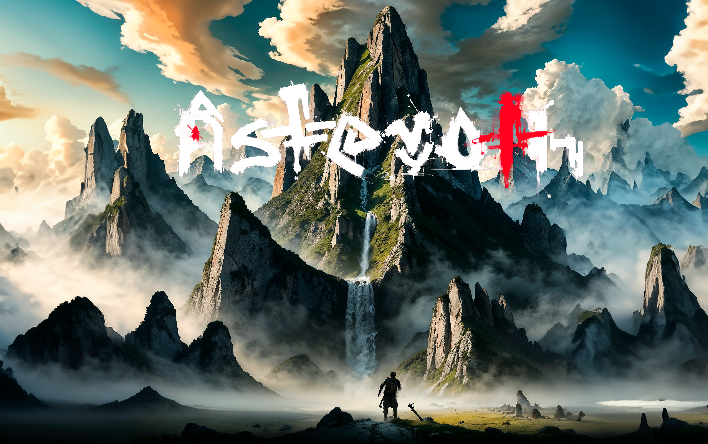
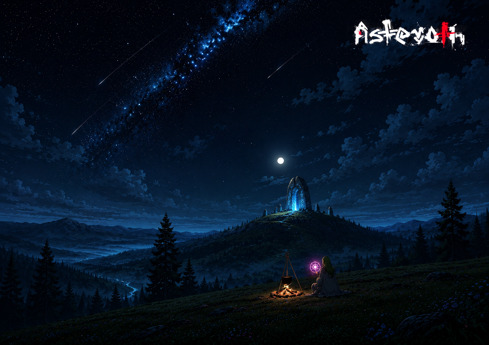
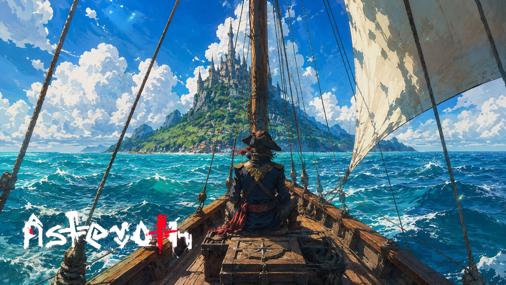

# Asteroth

> MMORPG isométrico em um planeta esférico, onde tudo o que existe foi construído (e pode ser destruído) pelos players.

Asteroth é um mundo persistente. Um único planeta, uma esfera real, gerada de uma seed. O mundo nasce vazio: sem cidades pré-fabricadas, sem NPCs em vilarejos, sem estruturas imutáveis. Toda civilização que existir nele será construída pelos próprios players. E tudo que é construído pode ser destruído ou pilhado.

A graça do jogo está no ciclo:

> **explorar → coletar → construir → defender → ser invadido → reconstruir.**

Cada partida do mundo (em escala de servidor, não de player) é uma história única, escrita pela comunidade.

---

## O que você vai encontrar aqui

Este é o **espaço público** do Asteroth, o canal externo do projeto. Aqui mora:

- **Lore do mundo** ([`LORE.md`](LORE.md)): a origem cosmogônica das partículas, Asteroth como entidade, e o mundo físico (planeta esférico, sol, duas luas, civilização player-driven).
- **Os Governantes** ([`GOVERNANTES.md`](GOVERNANTES.md)): o panteão das 26 entidades que dividem o domínio do planeta. Cthulhu, Azazel, Beelzebub, Metatron, Hastur, Abaron, Abaddon, Mammon, Baphomet, Asratheet, além dos 16 regentes menores. Cada um com sua própria condição de despertar.
- **Como o mundo funciona** ([`GAMEPLAY.md`](GAMEPLAY.md)): mecânicas de jogo (classes, fama) escritas como o jogador as entende.
- **Contos** ([`stories/`](stories/)): histórias curtas ambientadas no mundo. Material narrativo que pode virar livro no futuro.
- **Conceitos visuais** ([`concepts/worlds/`](concepts/worlds/)): concept arts do mundo, cada uma acompanhada de uma vinheta curta. Paisagens habitadas, momentos avulsos, atmosfera de Asteroth quando o panteão está em silêncio.
- **Status do projeto** ([`CHANGELOG.md`](CHANGELOG.md)): marcos públicos do desenvolvimento.

O **código-fonte** do jogo e da engine fica num repositório separado, privado.

## Apoie o projeto

Asteroth é um projeto pessoal, em desenvolvimento desde 2012, construído numa engine própria em C++. Sem publisher, sem investidor, sem prazo imposto. Cada apoiador tem peso real no ritmo de construção.

- **GitHub Sponsors** → [github.com/sponsors/LucasHiago](https://github.com/sponsors/LucasHiago)
- **Patreon** → [patreon.com/c/Asteroth](https://www.patreon.com/c/Asteroth)
- **Site** → [asteroth.com.br](https://asteroth.com.br)

## Pegada do jogo

Asteroth combina três influências:

- **Albion Online**: MMO isométrico, mundo persistente, economia 100% conduzida por players, social/guild driven.
- **Rust**: destruição, raid, full-loot, ausência de safe zones absolutas, tensão constante.
- **O diferencial Asteroth**: o mundo é **um planeta de verdade**, não um mapa plano. Você caminha em volta da esfera, há horizonte curvo, o sol nasce e se põe, duas luas atravessam o céu.

## Conceitos visuais

Um recorte da coleção em [`concepts/worlds/`](concepts/worlds/). Cada arte acompanha uma vinheta curta no mesmo arquivo.

| | |
|---|---|
|  |  |
| *[O herdeiro do vale](concepts/worlds/01-o-herdeiro-do-vale.md)* | *[A cartógrafa da Cidadela](concepts/worlds/04-a-cartografa-da-cidadela.md)* |
|  |  |
| *[A centelha de Asteroth](concepts/worlds/03-a-centelha-de-asteroth.md)* | *[A guardiã do portal âmbar](concepts/worlds/07-a-guardia-do-portal-ambar.md)* |
|  |  |
| *[A ilha do contrato](concepts/worlds/12-a-ilha-do-contrato.md)* | *[O caminho de Abneroon](concepts/worlds/06-o-caminho-de-abneroon.md)* |

Ver os 15 em [`concepts/worlds/`](concepts/worlds/).

## Status

Em desenvolvimento ativo. Atualmente na **Fase 0: Fundação 3D** (pipeline de renderização: cubo girando em isométrico, depth test, sistema de mesh). O roadmap segue até MMO infra (Fase 5) e conteúdo (Fase 6+). Marcos públicos vão aparecendo aqui no [`CHANGELOG.md`](CHANGELOG.md).
