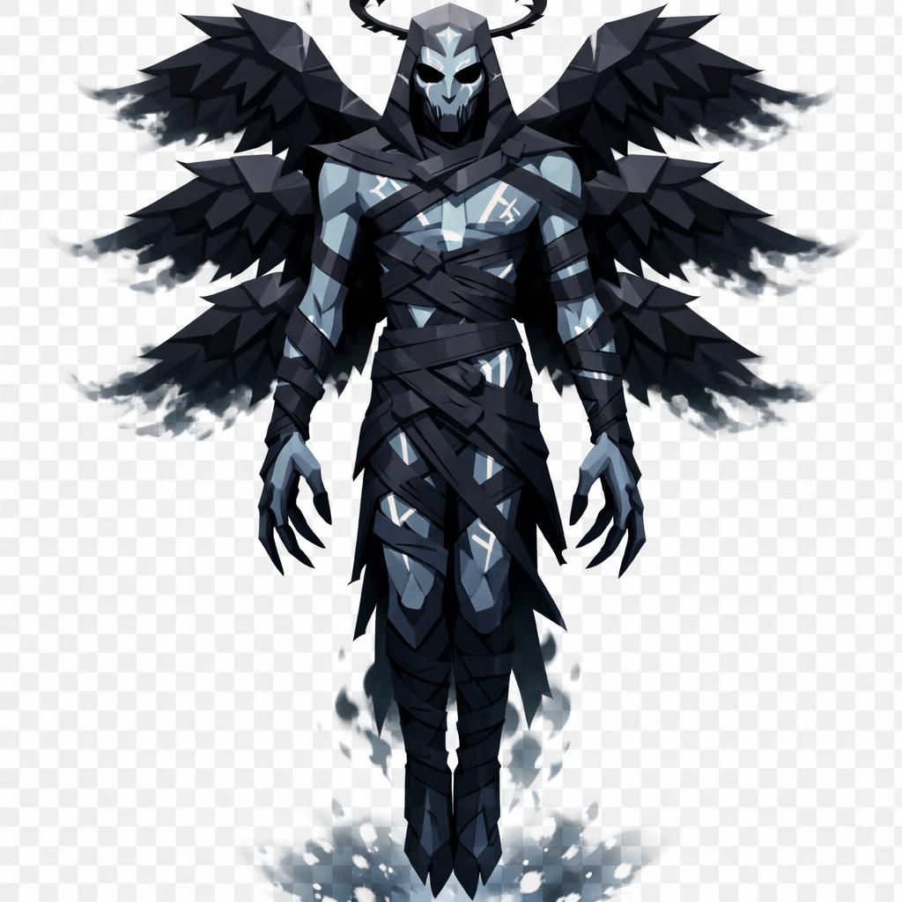

# Abaddon, o Anjo do Abismo

> *"O que dói não é o que ele faz. É o silêncio com que faz."*

---

Abaddon não pisa. Ele paira. Cerca de seis metros do solo até o topo da cabeça, mas os pés nunca tocam terra. A figura é magra, alongada, ombros largos demais pra cintura estreita demais, e os dedos das mãos são longos a ponto de incomodar.

O rosto já foi belo. Angular, simétrico, traços nobres. Hoje as bochechas afundaram, os olhos cavaram, e a boca está costurada com fio dourado, dois pontos cruzados sobre o lugar onde devia haver lábios. Quem costurou, ninguém sabe. Diz-se que ele mesmo o fez, depois da queda, pra nunca mais pronunciar o nome dos que serviu antes.

A pele é pálida, quase cinza-azulada. Dos cantos dos olhos, veios pretos descem pelas bochechas como rímel borrado. Os olhos em si não existem como globo, são duas chamas brancas e azuladas queimando direto nas órbitas vazias, soltando fagulhas continuamente.

O corpo está coberto de bandagens negras esfarrapadas, enroladas pelo peito e pela cintura, e por baixo delas a pele é cinza-cadáver. Sobre a pele, runas brilhantes brancas estão gravadas como tatuagem viva, descendo pela barriga e pelos braços. Parecem um livro sagrado escrito sobre a própria carne dele.

Atrás das costas, três pares de asas pretas. Não são uma seguida da outra, são empilhadas verticalmente, como em hierarquia angelical antiga. As penas, em low poly facetado, são pretas absolutas, com pontas que parecem se desfazer em fumaça. Algumas penas caem pra trás como brasas reversas.

Dos antebraços pendem correntes de ferro negro, soltas, com alguns elos quebrados. Os pés, descalços, são longos e ossudos.

Acima da cabeça flutua uma coroa quebrada de luz negra, contornada por um anel finíssimo de fogo branco. Um halo invertido, dizem.

Atrás do ombro direito, suspensa no ar, há uma chave enorme de ferro enegrecido. É a chave do abismo, e ele a carrega como quem não tem mais escolha. Nas costas, uma espada longa enferrujada, lâmina cravada de runas mortas, presa por nada.

Quando Abaddon chega, é porque cavaleiros demais morreram. Cada morte nobre o alimenta. E ele veio buscar o que sobrou.

---

*Sobre Abaddon em [GOVERNANTES.md](../../../GOVERNANTES.md#abaddon-o-anjo-do-abismo).*
