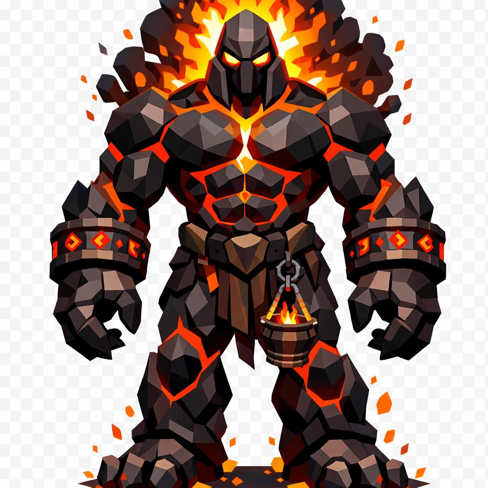

# Abaron, o Senhor das Chamas

> *"Era uma cratera. Agora é um homem. Tente desfazer essa equação se você consegue."*

---

Abaron é alto como uma torre, uns quinze metros. A postura é a de um soberano. Queixo erguido, ombros largos absurdos, peito imenso, abdômen rachado, braços e pernas musculosos com proporções de gigante. Ele não se curva pra falar com ninguém. Quem quiser ouvir, que se aproxime.

A cabeça é levemente alongada pra cima, lisa, sem cabelo, como se o crânio dele fosse um capacete fundido na própria carne. No topo, no lugar onde devia haver cabelo, há fogo. Não uma chama, uma juba inteira. Laranja vivo, amarelo solar e branco incandescente no núcleo, ondulando pra cima sem parar.

Os olhos são dois poços de lava. Sem pálpebras, sem branco, só lava fervendo em duas órbitas profundas. Brilho cintilante no centro, e filetes finos de magma escorrem pelas bochechas como lágrimas que não sabe que está chorando.

A pele inteira é basalto preto rachado. Por dentro, magma. As fendas se abrem mais nas articulações: joelhos, cotovelos, peito, e por essas fendas se vê o miolo vulcânico vivo. Quando ele flexiona um músculo, as rachaduras se alargam e mais luz vaza. Os antebraços têm braceletes de pedra vulcânica com runas brilhando em vermelho.

As mãos são enormes. Os dedos terminam em garras curtas de obsidiana. Os pés têm três dedos, pesados, e deixam rastro de cinzas e brasas no chão por onde ele passa.

Em torno do corpo, fumaça preta sobe dos ombros e da cabeça. Cinzas alaranjadas dançam em órbita. Pequenas labaredas pulam aleatoriamente do peito e dos antebraços, como se algo dentro dele estivesse sempre tentando sair.

Na cintura, presa por um cinto de couro queimado, ele carrega uma pequena forja. É um braseiro em miniatura, de bronze enegrecido, com fogo vivo dentro. Diz a lenda que aquele fogo é a primeira chama dele, a que nasceu junto com ele lá no vulcão. Ele nunca a apaga.

Se você ver Abaron, é porque alguém usou fogo pra destruir sem necessidade. Ele está aqui pra equilibrar a balança. Aprenda a respeitar o calor antes que ele te ensine.

---

*Sobre Abaron em [GOVERNANTES.md](../../../GOVERNANTES.md#abaron-o-senhor-das-chamas).*
