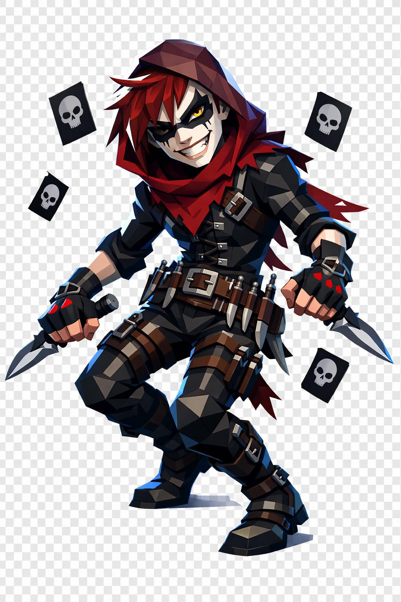

# Aslon, o Herdeiro Perturbado

> *"Ele ri antes. Ele ri durante. Quem mata sorrindo é o pior."*

---

Aslon parece um garoto. Dois metros, esbelto, nervoso, ágil. Ombros estreitos, braços longos, cintura fina, pernas atléticas. Mas a pose nunca está em equilíbrio total. Sempre meio inclinada, como uma mola prestes a soltar. Sempre semi-agachado, peso na ponta dos pés, uma adaga em cada mão em pegada invertida, cabeça ligeiramente inclinada.

O rosto é juvenil, traços finos, maçãs do rosto altas, queixo afiado. Pele clara, quase pálida. E o sorriso. O sorriso é largo demais, rasgado das bochechas, mostrando dentes brancos perfeitos demais, alinhados como pente. Dentes que não fazem sentido na vida que ele teve.

Em volta dos olhos, uma máscara teatral pintada em preto, sutil, como tinta borrada de palhaço sinistro. No canto da boca, uma cicatriz fina sobe formando um sorriso falso permanente, do lado oposto da cicatriz no olho.

Um olho é dourado-âmbar brilhante, pupila vertical fina como predador. O outro olho está coberto pelo cabelo, ou marcado por uma cicatriz longa em diagonal. Atrás dessa cicatriz, o olho escondido brilha em vermelho-sangue pelas frestas. Ninguém sabe qual é o olho verdadeiro.

O cabelo é vermelho-sangue desgrenhado, caído sobre um dos olhos, pontas irregulares como cortadas com adaga. Algumas mechas brancas no meio dos fios.

Veste um capuz curto vinho-escuro caído sobre os ombros, parte interna vermelho-sangue. Sob o capuz, um gibão justo de couro preto com fivelas prateadas atravessando o peito em diagonal. Cinto largo com diversas bainhas pequenas pra adagas. Calça justa preta enfiada em botas de couro com fivelas até o joelho. Em volta do pescoço, um xale rasgado vermelho-vinho enrolado como cachecol esfarrapado. Luvas pretas sem dedos nas duas mãos. Anéis de prata em vários dedos, pedras vermelhas pequenas.

Os braços são longos e finos, antebraços com tiras de couro enroladas. Os músculos são discretos, claramente treinados pra agilidade, não pra força.

As duas adagas são curvas, em pegada invertida. Lâminas prateadas com fio brilhante, manchadas levemente de vermelho-fresco. Cabos enrolados em couro preto, pomos em formato de bobo-da-corte rindo. Várias adagas menores estão distribuídas pelo cinto e nas coxas, em bainhas pretas.

Em uma das mãos, entre os dedos da mão livre, ele equilibra uma carta de baralho. Às vezes a carta voa próxima ao rosto. É o lado brincalhão dele.

Em volta dele, gotas de sangue flutuam, pequenas esferas vermelhas em órbita. Cartas de baralho voam em câmera lenta atrás do corpo, cartas pretas com símbolo de caveira. Dos calcanhares dele, pequena fumaça preta se desfaz como se ele tivesse acabado de pousar de um pulo.

Aslon não mata por dinheiro nem por vingança nem por crença. Mata porque é o que ele faz quando sai pra fora. Ele não tem motivo. Por isso é pior.

---

*Sobre Aslon em [GOVERNANTES.md](../../../GOVERNANTES.md#aslon).*
