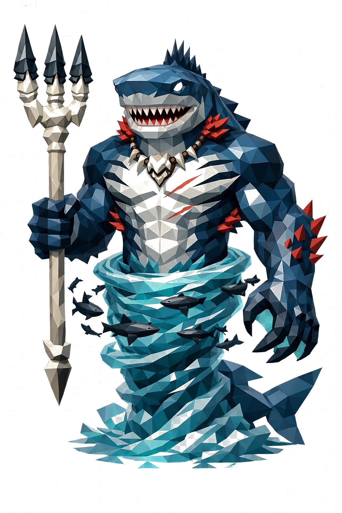

# Asratheet, o Senhor dos Mares

> *"O mar não obedece a ninguém. Mas o mar obedece a ele."*

---

Asratheet sai da água até a cintura. Só isso já é vinte metros. O que está debaixo da linha das ondas continua, mas ninguém viu o tamanho real. Quem tentou, virou parte do ecossistema.

O torso é massivo, musculoso, ombros tão largos quanto o casco de uma baleia jovem. Os braços são longos e pesados, com antebraços cobertos de espinhos curtos de coral vermelho. As mãos têm membranas translúcidas azul-esverdeadas entre os dedos, e cada dedo termina em garra preta curva.

A cabeça é de tubarão-tigre. Focinho longo e largo, várias fileiras de dentes triangulares brancos visíveis, sempre meio à mostra mesmo com a boca fechada. Os olhos estão nas laterais, brancos sem pupila, com o brilho gélido de uma tempestade. No topo do crânio, uma crista óssea afiada se estende pra trás como uma barbatana dorsal sobre a nuca.

A pele é coberta de escamas grandes, low poly, com brilho metálico. No dorso, azul-abissal profundo. Na barriga, prata pálida. Listras pretas atravessam o peito e os ombros, exatamente no padrão do tubarão-tigre. Em volta do pescoço e na lateral do peito, brânquias laterais abrem e fecham mostrando interior vermelho-coral.

No peito, cicatrizes brancas atravessam a carne. Não são feias, são troféus. Diz a lenda que cada uma delas é a marca de um leviatã que tentou desafiá-lo. Os leviatãs perderam.

Pelo dorso descem três barbatanas dorsais, em low poly facetado, com pontas afiadas em obsidiana negra.

A parte inferior do corpo se transforma numa cauda massiva de tubarão, listrada, terminando numa nadadeira caudal vertical gigante. Mas só uma fração está visível, o resto está mergulhado nas ondas facetadas embaixo.

Em torno da cintura, um vórtice de água gira lentamente, ondas low poly geométricas se elevando ao redor dele. Um cardume de tubarões pequenos circula o corpo dele em órbita, silhuetas escuras com olhos brancos brilhando, todos sob o comando dele sem precisar de ordem.

Na mão direita, um tridente colossal. A haste é osso de baleia branca, facetada. As três pontas são obsidiana negra com fileiras de dentes de tubarão incrustados. No pescoço, um colar de mandíbulas inteiras de tubarão, dentes pendurados como medalhas.

Quando os tubarões se juntam em número grande demais, é porque ele está chegando. Saia da água antes.

---

*Sobre Asratheet em [GOVERNANTES.md](../../../GOVERNANTES.md#asratheet-o-senhor-dos-mares).*
