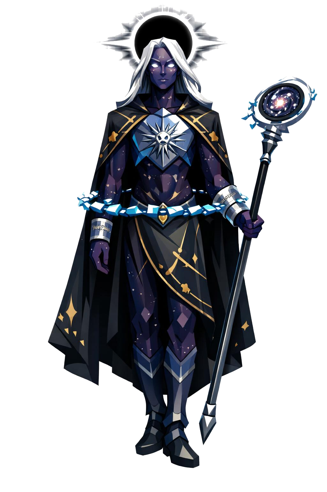

# Astaroth, a Mão Direita

> *"Não é o rei. Mas quando ele aparece, o rei está chegando."*

---

Importante de cara: Astaroth não é Asteroth. Astaroth é o mensageiro, o irmão mais velho, a mão direita. Asteroth é o rei que dorme em Nimue. Eles vivem sendo confundidos pelo nome. Pra quem encontra, a confusão dura pouco. Astaroth corrige sem precisar falar.

Cinco metros de altura, físico esbelto e perfeito. Ombros largos mas proporcionais, cintura estreita, postura impecável. Ele não se move muito. Quando se move, é como mensageiro real cumprindo função, contido, ritualístico.

O rosto é andrógino, traços nobres, simetria absoluta, sem pelos. O cabelo é longo, flutuante, da cor de prata estelar, descendo até a cintura, sempre mexido por um vento que ninguém mais sente. Sobrancelhas finas, queixo afiado, lábios fechados.

Os olhos não têm pálpebras. São duas estrelas brancas, e cada íris é uma constelação miniatura girando devagar. Sem pupila visível, apenas pontos de luz piscando como um céu noturno reduzido ao tamanho de um olhar.

A pele é violeta cósmico profundo, lisa e geométrica em low poly, e sobre ela há pontos luminosos brancos espalhados como pintas estelares pelo rosto, pescoço e mãos, desenhando constelações reais.

Ele veste um manto cerimonial longo até os pés, em preto noite, bordado em ouro com órbitas planetárias e símbolos astronômicos. Sob o manto, uma armadura leve de mithril azulado cobre o peito. No centro do peitoral, gravada, a imagem de uma partícula em colapso: círculo concêntrico irradiando linhas finas. Esse é o brasão dele.

A barra do manto se rasga em filamentos que viram estrelas individuais, partículas low poly douradas se desprendendo continuamente e flutuando pra cima como brasas reversas.

Nos antebraços, braceletes de mithril com escrita em alfabeto angelical. As mãos são finas, dedos longos, unhas pretas afiadas.

Em volta da cintura, um anel orbital horizontal, semelhante a Saturno, composto de fragmentos de mithril azulado luminoso girando lentamente. Atrás da cabeça, um halo em formato de eclipse solar, o disco preto e a coroa branca brilhante. Pequenas estrelas individuais flutuam ao redor da silhueta inteira como guarda.

Na mão direita, um cetro longo de mithril, com cabeça em forma de espiral galáctica que gira sozinha. No peito, pendurado por uma corrente fina, um fragmento de mithril azul brilhante.

Quando Astaroth aparece, ele não vem matar. Vem anunciar. Mas se você atrapalhar o anúncio, ele resolve isso primeiro.

---

*Sobre Astaroth em [GOVERNANTES.md](../../../GOVERNANTES.md#astaroth-a-mao-direita) e sobre o rei [Asteroth](../../../LORE.md#asteroth-o-filho-da-particula).*
