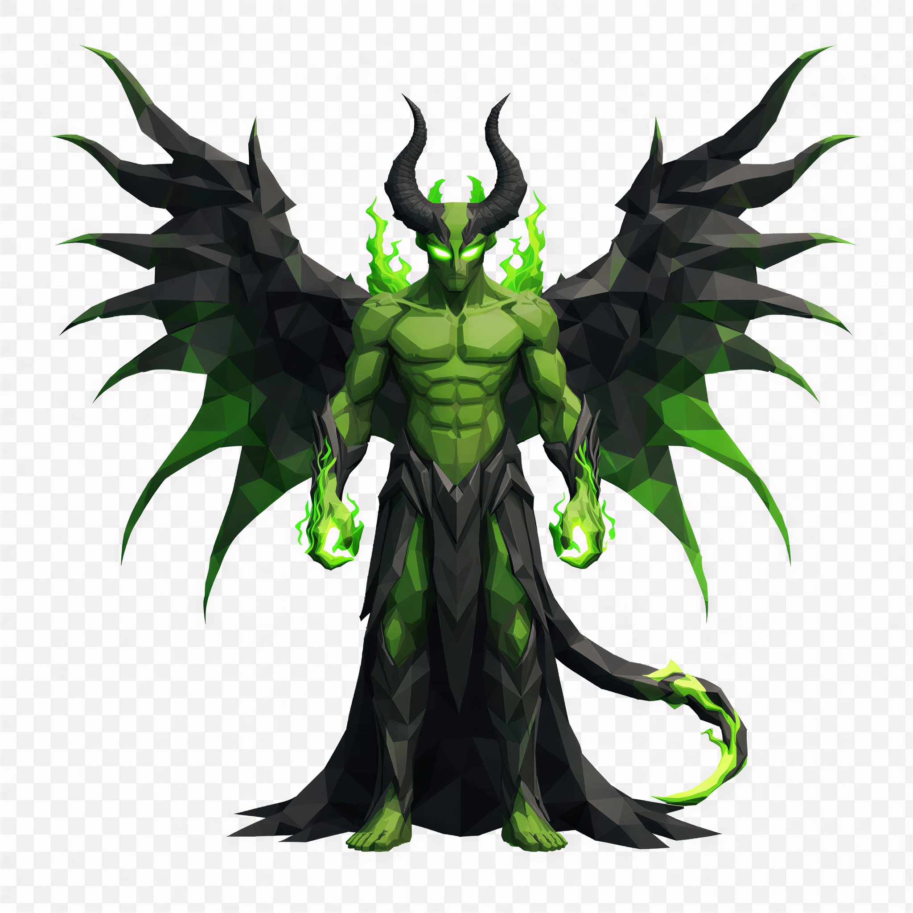

# Azazel, o Sussurro do Caos

> *"Ele não grita. Ele aconselha. E quando você obedece, já é tarde."*

---

Azazel se aproxima a cinco metros do chão. Não voa, não anda, só está. A pose é solene, ombros largos, peito definido como o de um homem que já foi exército inteiro. A pele tem a cor verde-musgo de coisa que cresceu na sombra, e brilha de leve, como se cada faceta da carne fosse um vitral por onde alguma luz interna escapa.

Os chifres saem direto da testa, dois pretos, longos, curvados pra cima como uma coroa que cresceu sozinha. Entre eles, nos olhos, o fogo verde. Não é fogo de queimar, é fogo de sussurrar. Esverdeado, fino, subindo das órbitas como ele estivesse pensando em voz alta na sua frente.

As asas se abrem atrás dele em diagonal, membranosas como de morcego, mas grandes demais pra qualquer morcego, escuras na borda e verde-vivo na membrana interna. Cada vez que ele respira fundo, as asas tremem de leve, como se confirmassem uma ideia.

Nas mãos, ele segura nada, e ainda assim você vê fogo. As palmas concentram esferas verdes de chama, e essas esferas são o que ele te oferece. Cada uma é uma sugestão. Cada uma é o nome de alguém em quem você devia confiar menos.

A cauda desce até os pés e termina em farpas. Ele não usa a cauda pra atacar, usa pra equilibrar, do mesmo jeito que usa a verdade pra equilibrar a mentira.

Por baixo da cintura, um manto preto cai liso até o chão, sem balançar, sem ar pra movê-lo. Quando você se aproxima demais, percebe que o manto não é tecido. É sombra costurada como tecido.

Se você sair vivo do encontro, vai sair com uma decisão tomada. Você acreditará que foi sua. Não foi.

---

*Sobre Azazel em [GOVERNANTES.md](../../../GOVERNANTES.md#azazel-o-sussurro-do-caos).*
