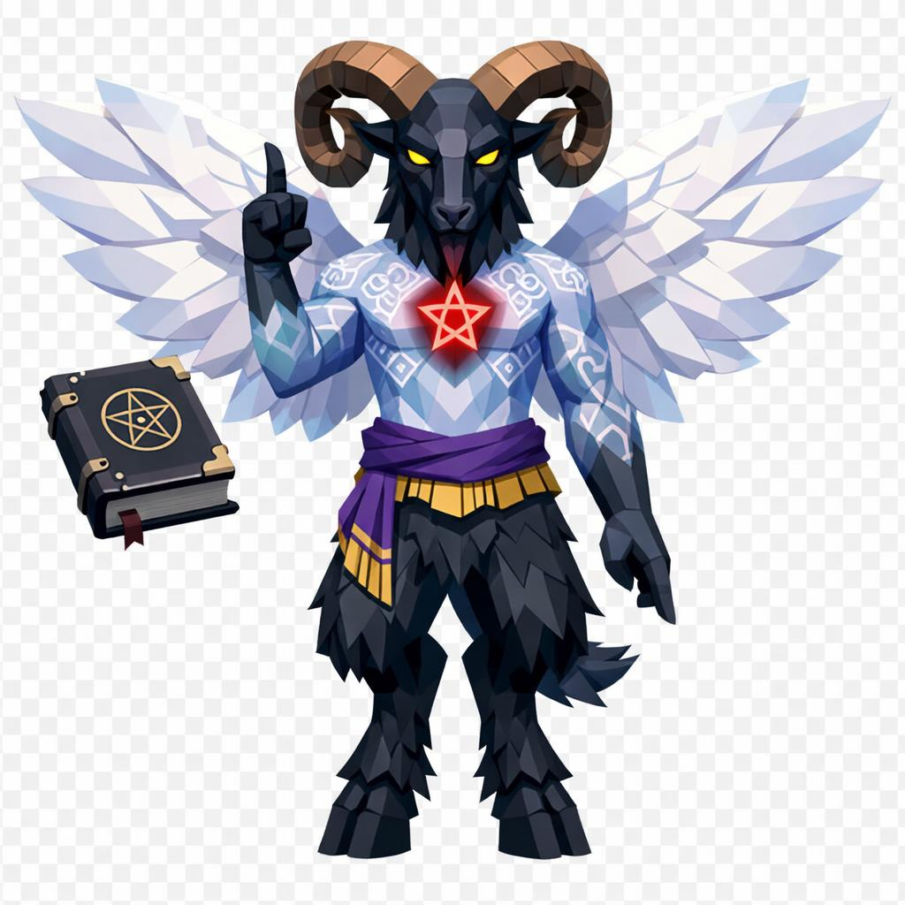

# Baphomet, o Senhor dos Mortos-Vivos

> *"Não escolha um lado dele pra olhar. Os dois lados estão olhando você."*

---

Baphomet tem quatro metros de altura e nenhuma intenção de se mover. A pose é hierática, ritualística, braços abertos: o direito apontando pra cima, o esquerdo apontando pra baixo. *Solve et coagula*, dizem os mais velhos. *Dissolve e coagula.* Sem isso, dizem, nenhuma transformação acontece no mundo.

O corpo é dividido em dois eixos simétricos opostos. De um lado, um peito feminino. Do outro, uma musculatura masculina. A cintura é estreita, os ombros largos mas estilizados. Não é homem nem mulher, é os dois e nenhum.

A cabeça não é humana. É de bode preto, pelagem escura e curta, focinho alongado. Dois grandes chifres de carneiro saem das laterais e se enrolam pra trás duas vezes, em bronze envelhecido. Entre os chifres, uma tocha central vive permanentemente acesa, chama branca em formato de pentagrama estilizado.

Os olhos são âmbar profundo, com pupilas verticais de bode. Brilham de leve, fixos. Não importa de que ângulo você o veja, os olhos parecem encontrar os seus.

A pele do tronco é cinza-azulada pálida, brilhante. Tatuagens ocultistas em branco e violeta cobrem o peito e os braços: símbolos astrológicos, sigilos, palavras em alfabetos esquecidos. No esterno, uma estrela invertida de cinco pontas brilha em vermelho-sangue sutil.

Nos antebraços, palavras escritas em letra preta. Direito: **SOLVE**. Esquerdo: **COAGULA**.

Atrás das costas, asas de serafim. Brancas, iridescentes, totalmente abertas, contrastando absurdamente com o resto do corpo sombrio. As penas são em geometria limpa, em fileiras decrescentes.

Da cintura pra baixo a transformação se completa. Pernas de bode peludo preto, joelhos invertidos, cascos pretos divididos. A pelagem cobre até o meio das coxas, onde transita de carne humana pra animal. Pequena cauda de bode com tufo na ponta atrás.

Em volta dele, almas etéreas flutuam em anel, silhuetas humanas translúcidas em branco-azulado, girando devagar. Atrás dele, um caduceu duplo de serpentes, uma branca e uma preta, entrelaçadas. À esquerda, um livro grosso de capa preta flutua.

Baphomet não é demônio. Não é santo. É o ponto onde os dois se cruzam. Quem o procura, procura conhecimento. Quem o encontra sem se preparar, encontra loucura.

---

*Sobre Baphomet em [GOVERNANTES.md](../../../GOVERNANTES.md#baphomet-o-senhor-dos-mortos-vivos).*
