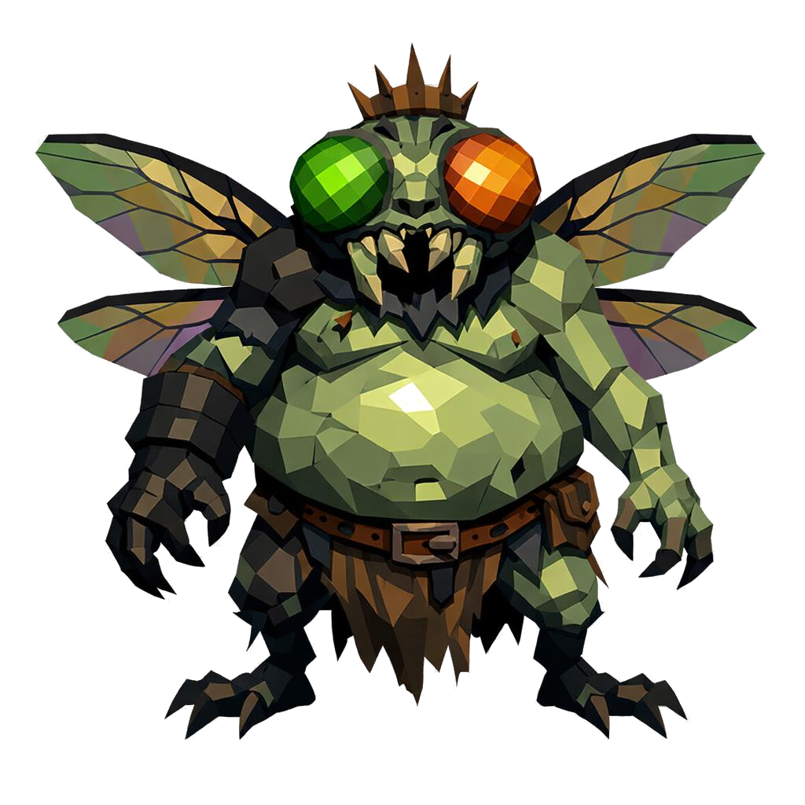

# Beelzebub, o Senhor das Moscas

> *"Antes dele aparecer, as moscas vieram. Depois das moscas, o cheiro. Depois do cheiro, ele."*

---

Beelzebub não é alto, é largo. Quatro metros, mas o que assusta é a forma. A barriga pende sobre as coxas abertas, grande demais pra um corpo que tenta caminhar. Os ombros são tortos, um braço notavelmente maior que o outro. Ele anda inclinado pra frente como quem está prestes a cair sobre algo morto pra comer.

A cabeça é a parte mais estranha. É uma cabeça de mosca, gigante, com dois olhos compostos no lugar dos olhos humanos. Cada olho é feito de centenas, talvez milhares, de hexágonos minúsculos espelhados em verde-esmeralda e âmbar podre. Quando você se aproxima, vê o seu próprio reflexo em cada um deles ao mesmo tempo. A mandíbula é dividida em quelíceras que se articulam, e gotas de muco amarelo escorrem entre elas continuamente.

Da testa saem duas antenas curtas, peludas, que se mexem sozinhas como se ouvissem coisas que ninguém mais ouve.

A pele dele é uma mistura repugnante. Carne pútrida verde-acinzentada, inchada, com pústulas abertas onde se veem larvas amarelas se mexendo. Por cima da carne, placas pretas duras como casca de besouro cobrem o peito, os ombros e os antebraços. Em algumas dessas placas, vermes pequenos entram e saem.

Atrás das costas, dois pares de asas. Translúcidas como de inseto comum, mas com membranas iridescentes, verde-petróleo, roxo e bronze, com nervuras pretas grossas. Sempre meio abertas, em posição de zumbido constante. O som dele é o som delas.

Em volta do corpo inteiro, uma nuvem de moscas. Pretas, verdes, douradas. Voam em padrão caótico, mais densas perto da barriga e da cabeça. Algumas pousam, outras decolam, é uma órbita viva.

Na cabeça, afundada na carne, ele usa uma coroa torta de ferro enferrujado, com espinhos crescidos por cima. Na cintura, um cinto largo de couro podre prende uma tanga rasgada coberta de larvas brancas.

Onde Beelzebub anda, o solo se enfraquece. Onde ele para, nasce pântano.

---

*Sobre Beelzebub em [GOVERNANTES.md](../../../GOVERNANTES.md#beelzebub-o-senhor-das-moscas).*
