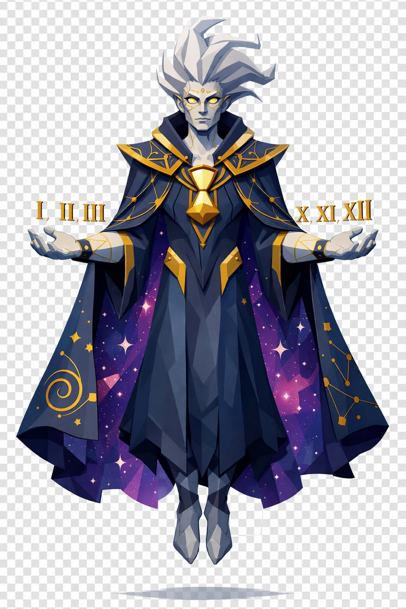

# Chronus, o Sentinela Eterno

> *"Ele não te mata. Ele te suspende. Você morre de outra coisa, séculos depois, sem saber."*

---

Chronus tem cinco metros de altura. A pose é hierática, solene, flutuando levemente acima do chão. Os braços abertos pros lados, palmas pra cima. O corpo é imponente porém esbelto, ombros largos, postura perfeitamente ereta. O movimento dele é mínimo. Ele literalmente paralisa o tempo ao seu redor pra parecer parado.

A cabeça é humanoide austera, traços simétricos e severos, maçãs do rosto altas, queixo afiado. A pele é mármore antigo cinza-pálido, com rachaduras finas atravessando o rosto como porcelana ancestral restaurada em ouro (kintsugi). O cabelo é branco-prateado longo, flutuando pra cima e pra trás como mexido por um vento temporal próprio.

Os olhos não são olhos. São dois mostradores de relógio em miniatura, com ponteiros dourados girando lentamente sobre fundo branco-leitoso. Sem pupila. Apenas o movimento dos ponteiros marcando segundos eternos. Se você olhar muito tempo, você não vai poder mais voltar atrás no que falou hoje.

Sobre a pele dos antebraços, algarismos romanos brilhantes em dourado flutuam levemente (I, V, X, L, C, D, M), como tatuagens flutuantes, não fixas. Mudam de posição.

Ele veste um manto ritualístico longuíssimo em camadas. A parte externa é azul-meia-noite profundo, bordada em ouro com constelações, ampulhetas e espirais cósmicas. A parte interna é roxo-galáctico estampado de pontos brancos como estrelas. O manto flutua perpetuamente, esvoaçando em câmera lenta independente do ar.

O capuz está caído pra trás, com bordado em dourado marcando ampulhetas e símbolos zodiacais nas bordas.

Sobre a túnica branca, ele usa um peitoral cerimonial dourado, com ampulheta central gigante gravada, e dentro dela areia dourada caindo continuamente. Em volta do pescoço, um colar de elos dourados com pequenas ampulhetas em miniatura penduradas, cada uma com areia de cor diferente: vermelha, branca, preta, azul, dourada. Cada uma é um tempo diferente.

As mãos são magras e elegantes, pele cinza-mármore com rachaduras douradas. Dedos longuíssimos terminando em unhas pretas curtas e afiadas. Anéis de ouro em vários dedos com pedras de tempo cristalizado, cristais translúcidos com galáxias dentro.

A parte inferior do corpo se dissolve em vórtice de areia dourada descendo, sem pés visíveis. Como se ele fosse construído a partir da areia escorrendo do céu.

Atrás dele, um relógio cósmico gigante. Mostrador em dourado pálido, ponteiros pretos girando, algarismos romanos brilhando. Anéis menores orbitam em torno como engrenagens flutuantes. É o halo dele, mas é também o sinal: o mundo ao redor anda no compasso do relógio dele agora.

Engrenagens douradas flutuam em órbita ao redor do corpo. Areia dourada cai de cima continuamente atravessando seu campo. Ao redor dele, pequenos fragmentos do tempo congelados flutuam: uma gota d'água parada no ar, uma folha imóvel, uma faísca pausada.

Na mão direita, um cetro longo dourado com cabeça em formato de ampulheta vertical, e areia preta caindo pra cima dentro dela. Tempo invertido. Cabo gravado de algarismos romanos.

Não distorça o tempo perto dele. Nem pra brincadeira. Ele percebe. Ele vem.

---

*Sobre Chronus em [GOVERNANTES.md](../../../GOVERNANTES.md#chronus).*
