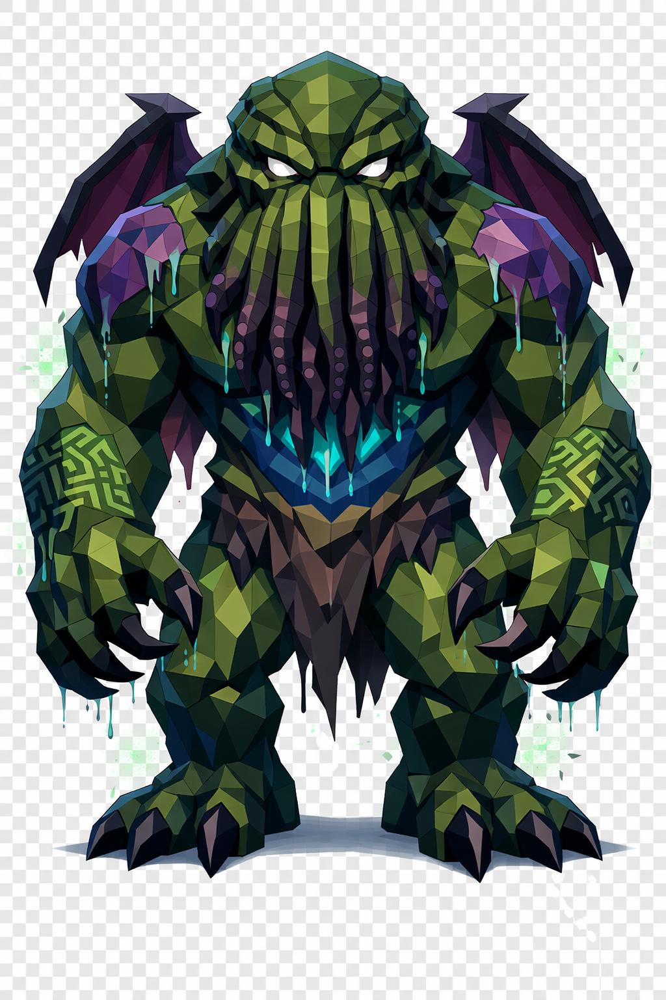

# Cthulhu, o Sumo Sacerdote dos Antigos

> *"Vimos a montanha respirar. Depois a montanha abriu a barba e a barba era viva."*

---

Cthulhu sobe da água como uma montanha que aprendeu a dobrar a cintura. Trinta metros, pelo que conta o único navegador que voltou. O resto não voltou.

A primeira coisa que se vê é a barba. Não é pelo. São tentáculos, dezenas, talvez mais, descendo do que deveria ser o queixo até quase o peito. Cobrem o lugar onde devia estar a boca, e ninguém sabe se ainda existe boca por baixo. Cada tentáculo é grosso como o tronco de um carvalho, e cobertos por ventosas que abrem e fecham num ritmo lento, como se respirassem fraco.

Acima da barba, dois olhos. Pequenos, brancos sem íris, e ainda assim ofuscantes, como se houvesse lâmpadas presas dentro das órbitas. O resto do rosto desaparece sob a sombra de uma testa cavada, coberta por escamas grossas como telhas de um templo afundado.

A pele dele tem a cor do musgo do fundo do mar. Verde profundo, manchado de veios azul-petróleo no peito, e linhas mais escuras de roxo escorrendo dos ombros como tinta esquecida. Em volta dos braços e do peito, runas que não fecham em geometria nenhuma que faça sentido. Quem fica olhando demais começa a esquecer o nome do próprio pai.

As asas estão atrás, atrofiadas. Membranosas, finas, esfarrapadas como folhas mortas. Eras dormindo no fundo do mar fizeram delas peso morto. Não voam mais. Talvez já não precisem.

Quando ele se move, partículas verdes e roxas flutuam ao redor da cabeça como esporos de uma planta que não devia existir. A água escorre dos ombros em filetes contínuos mesmo quando ele já saiu há tempo do mar. Pega na pele, escorre, evapora, não molha o chão.

Os pés têm três dedos cada, garras planas, próprias pra agarrar pedra molhada no fundo. As mãos são desproporcionais, palmas largas, dedos longos com garras pretas. Ele não precisa de arma. Ele é a arma. Ele é o sacerdote, e a igreja dele é tudo o que afunda.

---

*Sobre Cthulhu em [GOVERNANTES.md](../../../GOVERNANTES.md#cthulhu-o-sumo-sacerdote-dos-antigos).*
