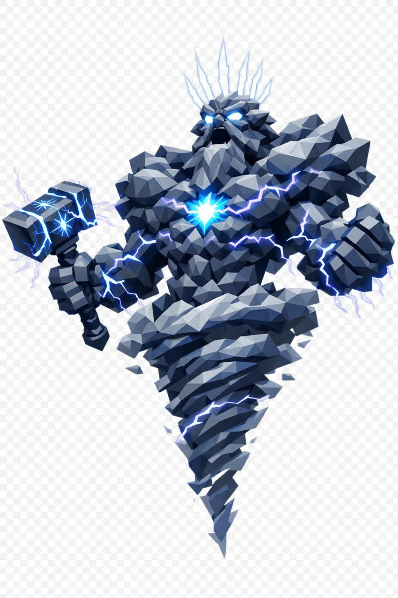

# Echtrhos, o Senhor das Tempestades Antigas

> *"Não corra. Esconda. Correr é trilha pra ele encontrar você."*

---

Echtrhos não tem corpo no sentido normal da palavra. É uma tempestade que aprendeu a ficar de pé. Quarenta metros de altura, talvez mais, depende de quanta nuvem ele consegue agregar no dia. A silhueta é humanoide, mas semi-formada: ombros impossivelmente largos, peito massivo de nuvem condensada, braços enormes terminando em punhos eletrificados, pernas grossas que se dissolvem em espiral de tornado abaixo da cintura. Não tem pés definidos.

A face é composta de nuvens torcidas em low poly. Os traços são apenas sugeridos: testa larga e ameaçadora, sobrancelhas grossas formadas por acúmulos de nuvem mais densa, barba longa em volutas de nuvem cinza-grafite descendo até o peito, mexida pelo vento. A boca está aberta num rugido silencioso. Da boca aberta saem raios.

Os olhos são dois orbes de relâmpago branco-azulado puro, sem pupila, brilhando intensamente, com faíscas saltando deles continuamente em raios pequenos.

O corpo é todo composto por camadas de nuvens facetadas low poly. Cinza-grafite profundo nas sombras, cinza-azulado nos meios-tons, branco-luminoso nos altos. Mas as nuvens não são estáticas. Pulsam, giram, têm veios elétricos brancos e roxos atravessando-as como sinapses vivas.

No centro do peito, através da densidade da nuvem, brilha um núcleo azul-elétrico. É o coração da tempestade. Linhas de raios descem do peito pelos flancos como nervuras.

Os braços são enormes, semi-translúcidos, com relâmpagos contínuos saltando entre os dedos. As mãos são esculpidas em nuvem mais densa, com dedos longos terminando em pontas de raio puro azul-branco. Eletricidade orbita os punhos como pulseiras vivas.

Da cintura pra baixo, o corpo se torna um tornado gigante facetado em espiral, girando, sugando detritos pra dentro: pedras, folhas, fragmentos pretos voando em loop. Sem pernas formadas, apenas a coluna de vórtice.

Acima da cabeça, uma coroa de sete raios brancos verticais apontando pra cima, como diadema elétrico. Em volta da silhueta, nuvens menores orbitam em rotação lenta. Pedras flutuam ao seu redor sendo eletrocutadas continuamente.

Na mão direita ele segura, de leve, um martelo de tempestade gigante. Cabo curto, cabeça em formato de bigorna com runas elétricas brilhando em azul-branco. Em volta da cintura, uma faixa de luz pura.

Não construa nada perto de onde Echtrhos foi visto, mesmo se ele dissipou no dia seguinte. Ele volta pro mesmo ponto. Sempre.

---

*Sobre Echtrhos em [GOVERNANTES.md](../../../GOVERNANTES.md#echtrhos).*
