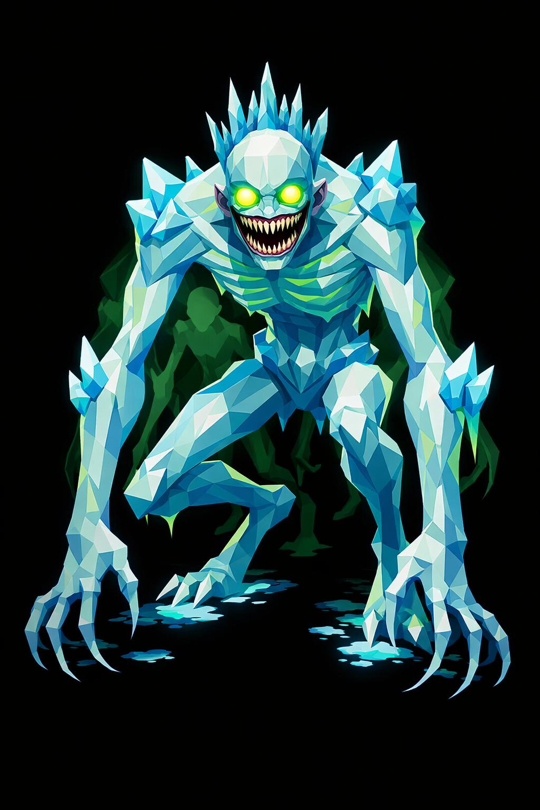

# Greenkir, o Sussurro do Gelo

> *"Mantenha a tocha acesa. Se ela apagar, ele já está dentro do raio."*

---

A primeira coisa errada em Greenkir são as proporções. Três metros e meio de altura, mas os braços vão quase até o chão, finos e longos demais. As pernas, magras, longas, com joelhos invertidos, como bicho. A cabeça é pequena demais pro corpo, posta no topo de um pescoço fino. Tudo nele parece esticado, como se alguém tivesse puxado uma figura humana pelas extremidades.

A pose é a de quem caça. Curvado pra frente, ombros tensos, braços pendurados na frente, sempre pronto. Ele não fica parado. Mas anda em silêncio absoluto, mesmo sobre gelo.

A cabeça é alongada pra trás, sem cabelo. O rosto não tem nariz. A boca atravessa de orelha a orelha, lábios finos, e dentro dela fileiras de dentes longos e finos como agulhas, mal alinhados, sempre num sorriso fixo. As maçãs do rosto são cavadas. O queixo é afiado.

Os olhos são dois círculos de luz verde-glacial brilhante, sem pupila, brilhando intensamente no escuro. À noite, eles aparecem antes do resto. Por isso muitos viajantes morrem de joelhos: viram os faróis verdes na escuridão e pensaram que era uma cidade longe.

A pele é azul-gelo pálido, translúcida. Por baixo, veias verde-fosforescentes pulsam como circuitos congelados. Da pele crescem placas de gelo low poly nos ombros, cotovelos e joelhos como espinhos translúcidos. Da nuca pra cima do crânio, uma coroa irregular de estalactites azuladas se forma como crepúsculo coagulado.

O peito está descoberto. As costelas saltam sob a pele fina. Os antebraços têm garras de gelo crescendo dos cotovelos como esporões. Os dedos terminam em unhas longas, curvas, finas como agulhas de gelo. Dez no total. Sempre prontas.

Os pés têm três dedos longos, pontiagudos. Ele pisa de leve, e onde pisa, o chão congela.

O hálito dele sai pela boca em volutas verdes, não brancas. Esse é o aviso final. O hálito dele é veneno alucinógeno. Quem o respira começa a ver coisas, pessoas, comida, ouro. Coisas que não estão lá. Vai atrás delas, e Greenkir vai atrás de você.

Na cintura, presa por um fio, ele carrega uma tocha apagada quebrada, troféu antigo. Mensagem: ele caça quem deixa o fogo morrer. No pescoço, um colar de pequenos crânios de animais congelados.

Atrás do corpo, silhuetas verdes fantasmas, ecos do que ele já matou, flutuam como sombras psicodélicas. Se você ver, você é o próximo.

---

*Sobre Greenkir em [GOVERNANTES.md](../../../GOVERNANTES.md#greenkir).*
