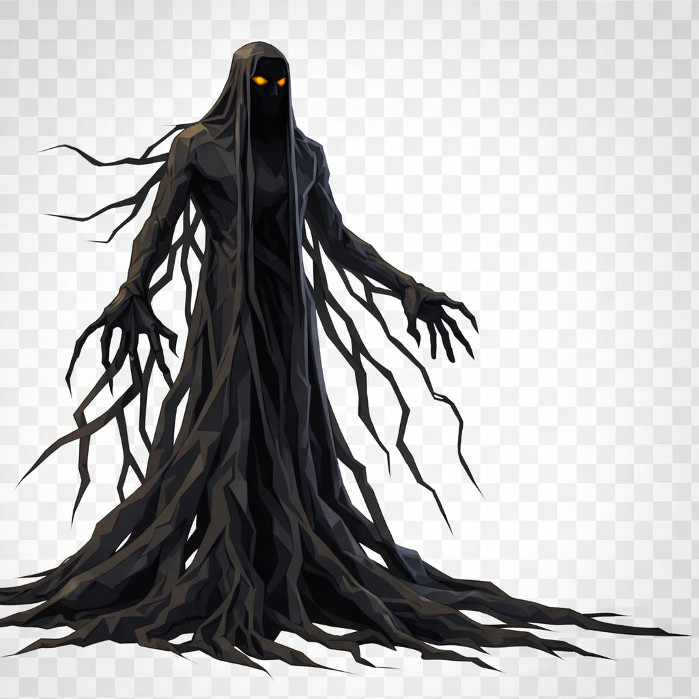

# Hastur, o Colosso

> *"Não tente entender a forma dele. A forma é só pra você ter pra onde olhar."*

---

A primeira coisa que se nota em Hastur é que ele é alto demais. Uns três metros, talvez mais, depende do dia, depende da luz. Os mais antigos juram que ele cresce conforme você o encara. Talvez seja verdade. Talvez seja o medo medindo errado.

Ele veste, ou parece vestir, um manto longuíssimo que cai até o chão e se desfaz no chão, ramificando-se em raízes negras, finas, secas, como se a barra do manto não fosse pano mas árvore morta. Os braços dele saem do mesmo manto, longos e magros, e as mãos também terminam em ramos, dedos esgalhados que se confundem com galhos.

A cabeça está coberta por um capuz. Sob o capuz, o rosto é uma sombra inteira, plana, sem traços. Só os olhos, dois pontos pequenos de **âmbar dourado** que brilham fundo como brasa por baixo da cinza. Não piscam. Não desviam.

A textura do corpo todo é negra com tons amarronzados, áspera como casca de árvore queimada. Por dentro, se houver dentro, dizem que é só vento parado.

Hastur não anda. Hastur aparece. Você olha pra trilha, ela está vazia. Você olha de novo, ele está em pé na frente do segundo carvalho, mais alto que o carvalho. O vento ao redor parou. Os pássaros pararam um pouco antes.

Quem porta a marca dele e morre, é quem o chama. Por isso ele caça primeiro os portadores. Não por crueldade, por economia: cada portador eliminado é uma boca a menos pra dizer o nome dele.

Se você ver Hastur sem ter sido convocado, é porque alguém na sua direção foi descuidado. Não é com você. Mas é em você.

---

*Sobre Hastur em [GOVERNANTES.md](../../../GOVERNANTES.md#hastur-o-colosso).*
