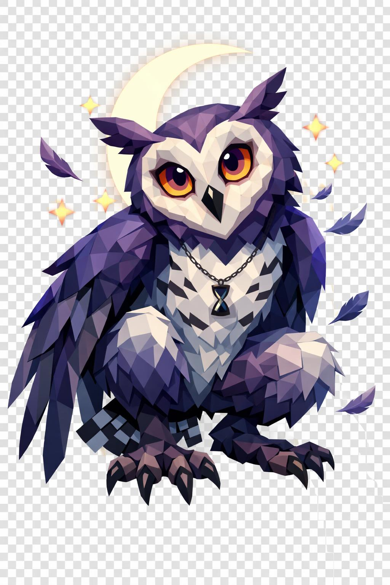

# Iymue, a Coruja do Pesadelo

> *"Você ouve o silêncio dela antes de qualquer outra coisa. É um silêncio que tem peso."*

---

Iymue é alta, dois metros e oitenta, e ainda assim parece leve. Os ossos dela devem ser ocos, como os de qualquer pássaro. Os braços são asas, as pernas são finas e fortes, terminando em garras. Quando pousa, pousa sem som.

A cabeça é desproporcional ao corpo. Uma cabeça de coruja gigantesca, redonda. O disco facial é em penas pálidas, em formato de coração. O bico é curto, curvo, afiado, em preto fosco, levemente entreaberto. Pequenos tufos de penas eretas como orelhas pontudas sobem das laterais do crânio.

Os olhos. Os olhos dela são o problema. Dois orbes enormes em amarelo-violeta ocupando boa parte do rosto, pupilas pretas verticais finas. Quando você olha, ela está olhando de volta, mas há algo a mais: dentro dos orbes, um céu noturno estrelado se mexe, devagar, real. Não há pálpebras visíveis. Quem fica encarando começa a sentir sono. Não é metáfora.

O corpo é coberto de penas low poly em padrão estratificado. No dorso, roxo-escuro profundo. Nos flancos, cinza-azulado. No peito e na barriga, branco-luar com listras horizontais finas pretas, exatamente como uma coruja-real. O rosto facial é em penas brancas formando o disco característico.

Os braços são asas-braço fundidas. Semi-abertas em alerta. As penas primárias são longas, pretas-violeta. As secundárias são mais claras, roxo-cinza. Da metade pra baixo de cada asa, ainda existem mãos finas com três garras pretas por mão, ainda funcionais, ainda capazes de agarrar com precisão.

As pernas são cobertas de penugem branca até o joelho. Os pés são enormes, com quatro garras pretas afiadas cada (três pra frente, uma pra trás). Garras de caçadora.

Atrás, um leque curto de penas em padrão xadrez de preto e branco serve de cauda, equilíbrio em voo.

Em volta dela há sempre o que ninguém mais tem: uma lua crescente luminosa flutuando atrás da cabeça como halo invertido. Estrelas pequenas low poly orbitam o corpo. Penas soltas caem em câmera lenta. Aos pés dela, uma sombra mais densa que sombra normal se acumula, derramando-se como tinta no chão.

No pescoço, um colar fino com um pendente em formato de ampulheta de areia preta. Lembrete: o tempo do incauto está acabando.

Ela espia. Sempre espia. Não ataca de imediato. Estuda, decide, escolhe o ângulo. Quando finalmente desce, você nem vai ter tempo de virar.

---

*Sobre Iymue em [GOVERNANTES.md](../../../GOVERNANTES.md#iymue).*
