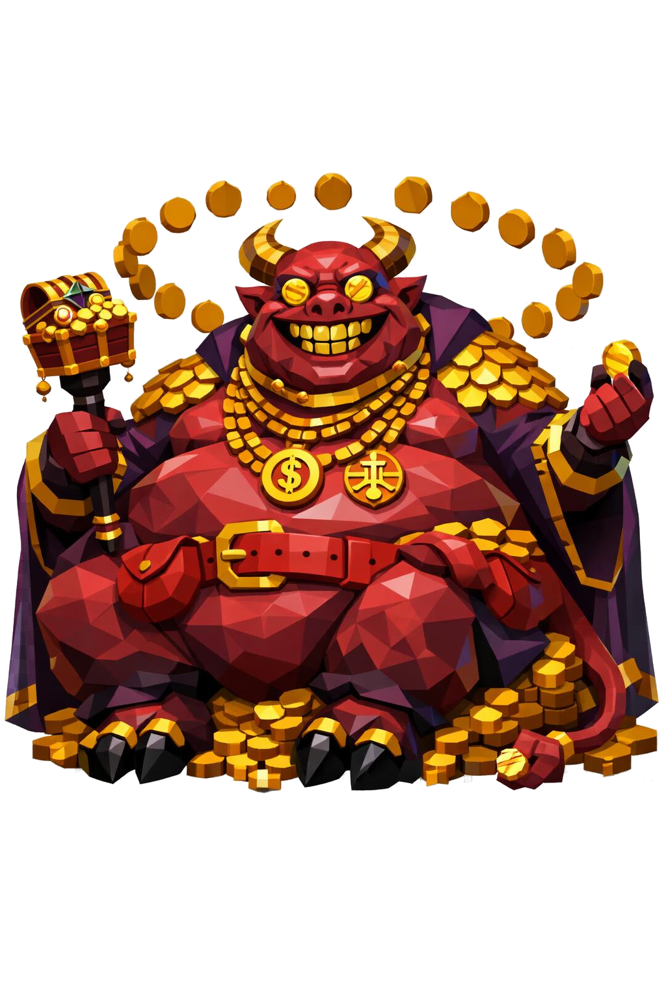

# Mammon, o Demônio da Avareza

> *"Você não vai querer matar Mammon. Você vai querer ser ele."*

---

Mammon é gordo demais pra ficar em pé com elegância. Cinco metros sentado, talvez mais se quisesse se levantar, mas ele não quer. Está sentado num pequeno trono de moedas amontoadas, as coxas afastadas, a barriga monumental pendendo entre elas, o peito flácido, papada tripla. Um braço apoia o queixo, o outro segura moedas que escorrem entre os dedos sem parar, como se ele estivesse sempre demonstrando que sobra.

O rosto é largo, bochechas estufadas, o sorriso preso ali. Os dentes são de ouro maciço, alinhados certinhos como pente. O nariz é achatado como o de um porco, com narinas largas. Da testa nascem dois chifres curtos, de carneiro, torcidos pra cima, ambos folheados a ouro, com entalhes de moedas antigas gravados em volta.

Os olhos são moedas. Duas moedas de ouro brilhante encaixadas nas órbitas, cada uma marcada com um símbolo monetário arcano, e no centro delas, pupilas pretas em formato de cifrão vertical. Quando ele te olha, você se sente avaliado em valor de mercado.

A pele é vermelho-vinho, oleosa, brilhante de unção. Pintas escuras espalhadas. Em volta do pescoço, dobras grossas como anéis de gordura formados em camadas. Crescendo dos ombros, do peito e dos antebraços, escamas douradas. Não são jóias presas, é a pele que virou ouro com o tempo, como crosta.

Por cima de tudo, um manto longo púrpura imperial cai dos ombros pra trás, forrado por dentro com tecido dourado bordado com fios de prata. No peito, correntes grossas de ouro sobrepostas, com medalhões: balanças, baús, símbolos arcanos de cifrão. O cinto largo é de couro vermelho, e dele pendem bolsas estufadas que tilintam quando ele se move.

As pernas terminam em cascos pretos divididos como de bode, com anéis de ouro nos artelhos. Atrás, uma cauda fina, cor da pele, com ponta em formato de mão fechada segurando uma moeda.

Em uma das mãos ele carrega um cetro curto, cabeça em forma de baú aberto transbordando jóias. Cada dedo tem um anel enorme, rubi, esmeralda, diamante, em geometria pesada e cara.

Ao redor dele, moedas flutuam em órbita lenta, e debaixo dos pés se forma um pequeno lago de ouro líquido. Você nunca o derrota. Você só decide se aceita ou não a oferta.

---

*Sobre Mammon em [GOVERNANTES.md](../../../GOVERNANTES.md#mammon-o-demonio-da-avareza).*
