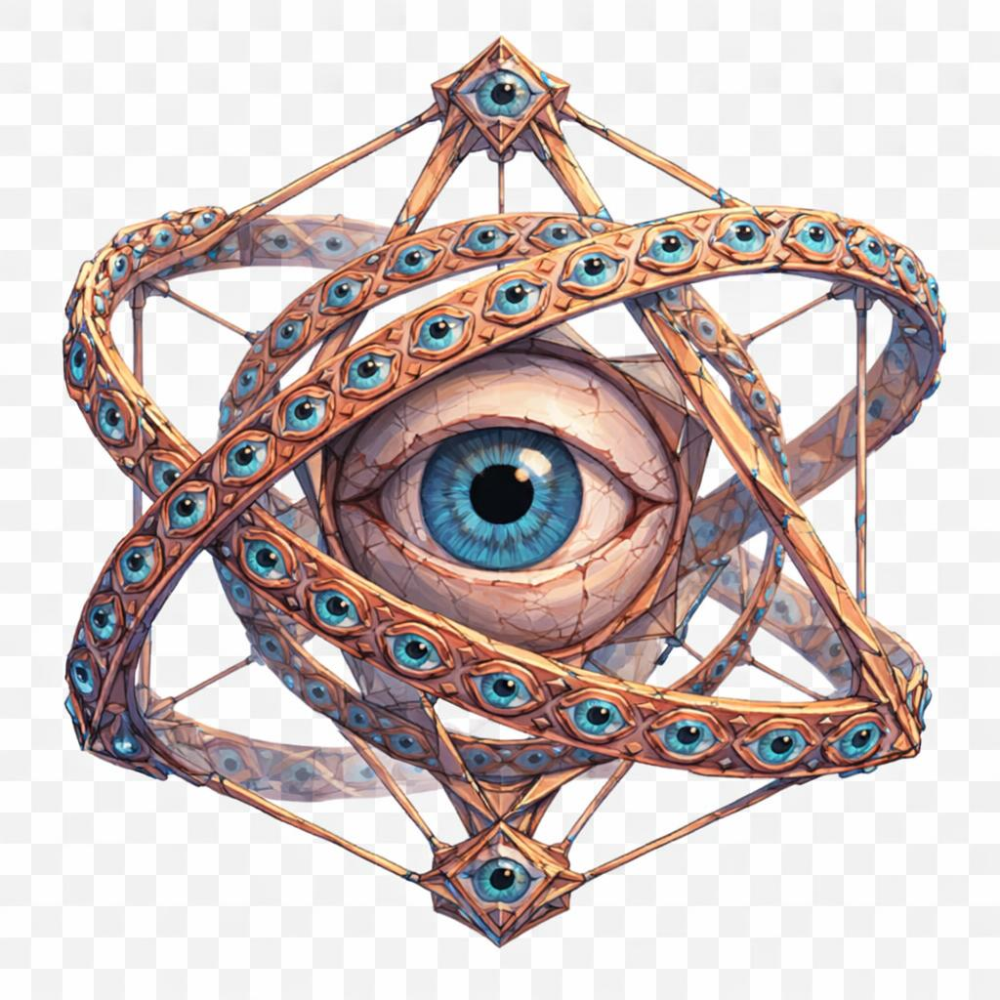

# Metatron, a Voz Celestial

> *"Não tem rosto, não tem corpo. Só olhos, e a sentença que vem deles."*

---

Metatron não é um corpo. É uma estrutura.

O que aparece no céu, quando alguém peca grande, parece primeiro uma estrela cravada num lugar errado. Depois, conforme você foca, vai virando uma geometria. Anéis de bronze, ou cobre, ou de uma liga que não tem nome neste planeta, atravessam-se em ângulos que não fazem sentido em três dimensões. Pra cada anel, dezenas de olhos.

Os olhos pequenos são esculpidos nos anéis em alto-relevo, cada um com íris **azul-celeste**, pupila preta no centro, e todos olhando ao mesmo tempo pra direções diferentes. Não há padrão. Há cobertura. Não há ângulo no mundo que escape.

No centro da estrutura, um olho gigante. Esse não está esculpido, esse é vivo, ou parece vivo. A íris é o mesmo azul, mas maior, mais profunda, com finíssimos fios escuros lembrando os meridianos de um globo. A pupila no meio é um buraco escuro com fim. Esse olho não varre. Esse olho lê. Você sente que ele já leu sua vida toda no instante em que olha.

A estrutura inteira flutua. As pontas externas dos anéis terminam em diamantes geométricos, também com olhos no centro, em formato de losango. Dentro de cada um, um olhinho azul piscando devagar.

Não há som. Não há grito. A justiça de Metatron não é falada. Ela é decidida.

Aqueles que sobrevivem ao encontro, e poucos sobrevivem, descrevem a mesma sensação: silêncio absoluto, e a certeza de que toda mentira que já contaram foi lida em ordem cronológica antes do veredito.

Não é um inimigo. É uma sentença. Quem é justo passa. Quem não é, é corrigido.

---

*Sobre Metatron em [GOVERNANTES.md](../../../GOVERNANTES.md#metatron-a-voz-celestial).*
