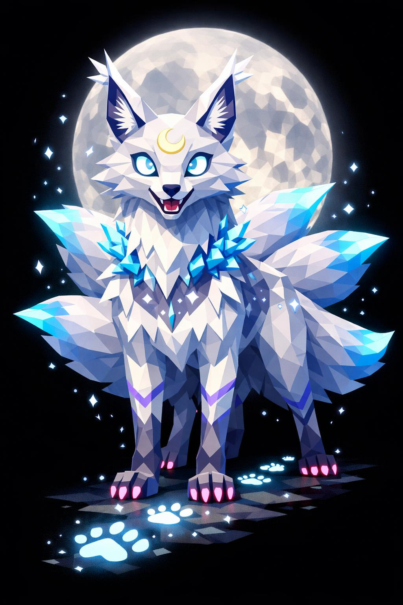

# Moon, a Raposa Luminescente

> *"Ela é bonita. Continue olhando, esse é o erro."*

---

Moon não engana propositalmente. Ela só é assim. Bela à primeira vista, letal no segundo olhar. O nome não é piada. Pra quem foi achado vivo depois (poucos), a frase que repetem é a mesma: *"eu não consegui me mover"*.

É raposa. Do tamanho de um lobo grande, dois metros e meio no ombro quando em pé sobre as quatro patas. O físico é alongado, esbelto, ágil como felino, com a graça idealizada de uma raposa. Focinho fino e elegante. Boca entreaberta mostrando dentes brancos pontiagudos sem língua visível. Orelhas grandes triangulares eretas, com tufos longos de pelo branco-luar nas pontas.

Os olhos são duas luas crescentes brilhantes, em azul-luar pálido, com um halo branco ao redor. Sem pupilas redondas. Apenas o brilho lunar. Hipnotizantes. Você olha um pouco demais e se esquece de algo importante, como respirar.

A pelagem é curta, brilhante. Branco-luar luminoso com pontas azul-prateadas, como se cada fio tivesse sido pintado pela lua. Manchas mais escuras prateadas ao longo das costas, ombros e laterais, criando um padrão de constelação. Listras finas violetas subindo das patas pro tronco. O peito e a barriga em branco-leitoso brilhante.

Atrás dela, três caudas longas, exuberantes, abertas em leque. Pelagem volumosa, cada cauda com pontas brilhantes em azul-luar fluorescente como se brilhassem com luz própria. Cada cauda mais comprida que o corpo dela.

As patas são finas e ágeis. Garras retráteis pretas afiadas, parcialmente expostas, sinalizando intenção. As almofadas das patas são rosa-claro brilhando levemente.

Na testa, uma marca em formato de lua crescente, dourado-pálida luminosa, sinal divino. No colar do pescoço, cristais luminosos azuis crescem como uma juba curta de gelo. Das pontas das caudas, pequenas faíscas azuis caem como caspa estelar.

Em volta dela, partículas de luar low poly flutuam, círculos pequenos branco-azulados. A sombra dela é violeta, contrastando absurdamente com o brilho do corpo. Atrás dela, uma silhueta de lua cheia gigante difusa, sugerida como halo amplo. Por onde passa, deixa pegadas brilhantes no chão.

A pose é elegante, sedutora. Cabeça levemente baixa, olhar de baixo pra cima. Sorriso mostrando dentes, mas o sorriso de quem se diverte. Mais sedução do que ameaça. E é exatamente isso que a faz perigosa.

Se você sentir vontade de chegar mais perto, é tarde demais. Ela já está dentro do raio dela há cinco minutos.

---

*Sobre Moon em [GOVERNANTES.md](../../../GOVERNANTES.md#moon).*
