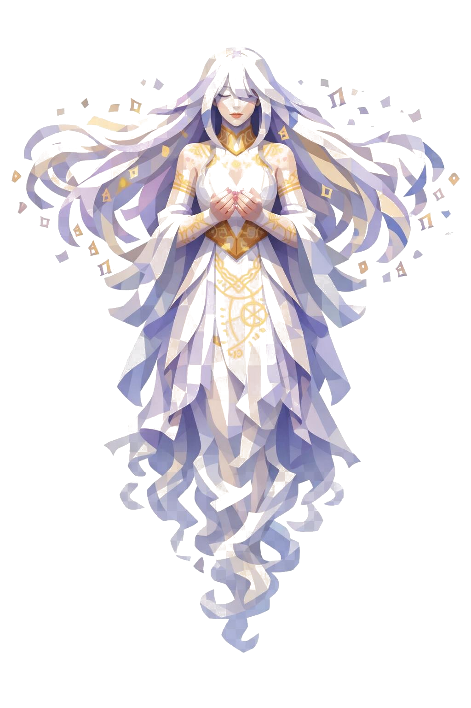

# Nephile, a Guardiã de Segredos Esquecidos

> *"Quem é digno pode olhar. Quem olha sem ser, esquece o próprio nome."*

---

Nephile não toca o chão. Três metros de altura aproximada, mas os pés estão sempre suspensos no ar, e abaixo dos joelhos o corpo se dissolve em espirais de fumaça branca-pérola descendo. Não tem pernas claras, é como se ela tivesse sido cortada na altura da coxa e o resto fosse vapor.

A pose é etérea, suspensa. As mãos vêm pra frente em concha, como segurando um segredo precioso.

O rosto é feminino, angelical, traços suaves e simétricos. Os olhos estão fechados, ou velados (ela vê sem olhar). Lábios finos pintados em dourado-pálido. A pele é lisa, sem rugas, eterna. Quando os olhos se abrem, são brancos sem íris, com brilho leitoso, projetando uma linha tênue de pergaminho à frente como se lesse o ar.

O cabelo é longuíssimo, flutuante, descendo da cabeça em ondas suaves. Paleta branco-pérola com mechas em lavanda-suave e dourado-pálido. Mexido por um vento próprio. As pontas dos fios se desfazem em pequenos polígonos de letras flutuando, fragmentos de palavras antigas.

A pele é branca-pérola levemente azulada, translúcida em partes. Por baixo, visíveis através da carne, runas internas brilham em dourado-âmbar, como se ela fosse iluminada de dentro. Tatuagens em tinta dourada-pálida descem pela nuca, ombros e antebraços: sigilos antigos, alfabetos esquecidos, mapas estelares miniaturas.

Veste um vestido longo flutuante em camadas de tecido fino translúcido. A parte externa é branco-pérola. A interna, lavanda-pálido. Bordados dourados desenham símbolos angelicais e órbitas planetárias. As mangas longas flutuam soltas, transformando-se em véus que se dissolvem nas pontas. Um cinto fino de fios dourados trançados marca a cintura.

Um véu translúcido cai da cabeça pela parte de trás como manto leve, em branco-pérola, esvoaçando perpetuamente.

As mãos são finas e elegantes. Unhas curtas pintadas em dourado. Anéis finos em vários dedos com pedras minúsculas: opalas, ametistas, citrinos em geometria low poly.

Em volta dela, pergaminhos antigos enrolados flutuam em órbita, com selos vermelhos marcando-os. Livros pequenos giram atrás, capas em couro velho com fechaduras douradas. Letras douradas em alfabeto angelical flutuam como faíscas. Um halo dourado fino acima da cabeça oscila entre opacidade e transparência.

Entre as mãos em concha, ela segura uma pequena esfera de luz dourada como jóia preciosa, e dentro dessa esfera há um olho miniatura que pisca. É o segredo guardado. Cada Nephile carrega um. Não o mesmo.

Toda a silhueta dela alterna entre visível e parcialmente invisível, como se algumas partes estivessem fora de fase com a realidade. Os ombros e o véu são as áreas mais translúcidas. O rosto e o coração são as mais sólidas. É difícil mirar nela com olho normal.

Se ela aparecer pra você, é porque você descobriu algo que não devia. Pode mudar isso? Pode. Mas o preço da troca, ela decide.

---

*Sobre Nephile em [GOVERNANTES.md](../../../GOVERNANTES.md#nephile).*
