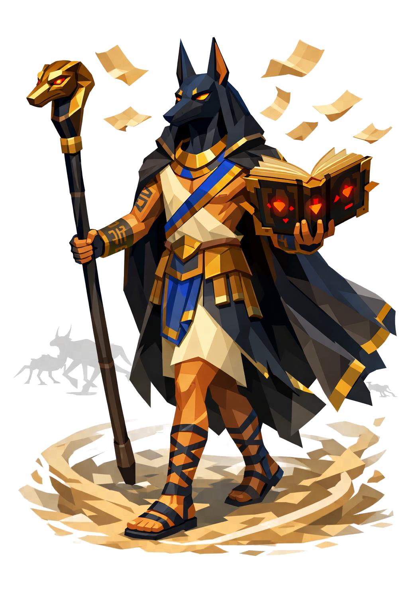

# Neron, o Nômade do Tomo

> *"Ele aparece no horizonte. As coisas que vêm com ele vêm depois."*

---

Neron caminha. Sempre. Mesmo parado, parece estar em marcha. Dois metros e meio, esbelto, ombros estreitos, postura ereta de viajante experiente. Os passos são longos, calmos, sem pressa.

A cabeça é de chacal. Focinho longo e afiado, orelhas pontudas eretas pra cima, pelagem curta e fina em preto-azulado. A boca permanece fechada em concentração, o maxilar marcado mostrando estrutura forte. Não rosna. Quem vê Neron rosnar não vê mais nada.

Os olhos são dourado-âmbar profundo, pupila vertical fina como gato. Sem expressão de raiva, apenas vigilância silenciosa de quem já viu tudo várias vezes.

O corpo humanoide abaixo do pescoço é bronzeado-areia, e descendo pelos braços corre tinta azul-índigo: hieróglifos antigos tatuados na pele. Escaravelhos, ankhs, olhos de Horus estilizados em geometria low poly.

Ele veste um manto longuíssimo até os pés, em preto-noite, debrum dourado nas bordas. O capuz está sempre puxado pra trás, deixando a cabeça de chacal exposta. Sob o manto, uma túnica de linho cru, branca-amarelada, atravessada por uma faixa azul-cobalto bordada de ouro. Da cintura pra baixo, um saiote estilo egípcio em couro escuro com placas douradas pendendo.

Os antebraços têm braçadeiras de bronze com escrita hieroglífica. As mãos são finas, unhas curtas pretas, dedos longos. Nos pés, sandálias estilo egípcio com tiras subindo pelas panturrilhas até abaixo dos joelhos.

Ao lado do braço direito, sempre flutuando, sem tocar a mão, está o tomo. Grosso. Capa preta com gravuras douradas, ilustrações de monstros rastejantes. Páginas amareladas, e nas páginas, runas brilhando em vermelho-sangue. Esse livro nunca toca o chão. Não se sabe se Neron o controla ou se é o oposto.

Na mão esquerda, um cajado longo de madeira escura facetada. A ponta superior tem uma cabeça de chacal dourada com olhos de rubi.

Em volta dos pés, um vórtice baixo de areia low poly se forma como se o deserto o seguisse pra todo lado. Páginas soltas voam ao redor da cabeça dele, pequenos retângulos amarelados com escrita preta girando lentamente. Um vento próprio mexe só o manto dele, mesmo num dia sem brisa.

Quando Neron aparece no horizonte, conte os passos dele. Se ele se aproximar mais de cem passos sem você sair, contagem regressiva está acabando. As coisas que ele invoca não andam. Saem do livro direto.

---

*Sobre Neron em [GOVERNANTES.md](../../../GOVERNANTES.md#neron).*
