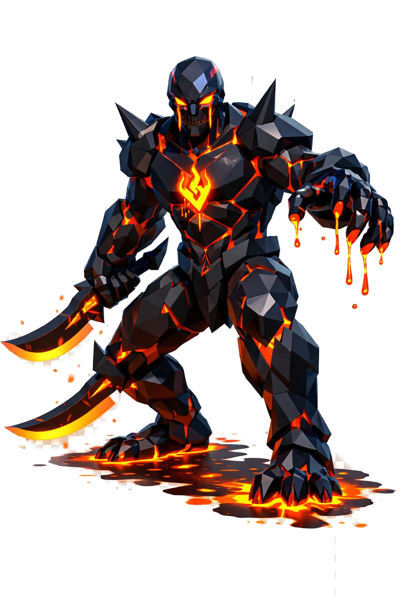

# Obsien, o Senhor do Vidro Vulcânico

> *"Ele é feito de magma e ainda assim é o mais rápido. Reze pra encontrar outra coisa antes."*

---

Obsien tem quatro metros e nunca está parado. Mesmo quando você o vê de longe e ele parece imóvel, alguma coisa nele se move. Uma rachadura piscando, um pingo de magma escorrendo, uma faceta de obsidiana brilhando de outro ângulo num segundo. Ele é incômodo de olhar. Os olhos cansam.

O físico é atlético, ágil, surpreendentemente ágil pra alguém feito de pedra e fogo. Ombros largos, cintura definida, pernas musculosas e proporcionais. A pose é sempre dinâmica, peso num pé, peso no outro, braço à frente, lâmina apontada. Ele nunca posa pra retrato. Quem o pintou, pintou de memória.

A cabeça é facetada em obsidiana pura, polida como espelho negro. Nas facetas, reflexos azulados e roxos dançam conforme a luz. Não tem cabelo. O rosto é atravessado por rachaduras finas, e por essas rachaduras vaza magma laranja-vermelho pulsante, principalmente em volta da boca e dos olhos.

Os olhos não são olhos. São fendas alongadas com lava brilhante dentro, escorrendo levemente em lágrimas de fogo que evaporam antes de cair.

O corpo é composto por placas geométricas de obsidiana negra brilhante, dispostas como armadura natural fundida na carne. Entre as placas, rachaduras vivas mostram magma fluindo em vermelho, laranja e amarelo. A textura alterna entre superfície de vidro polido e veios de lava em movimento. As articulações são as áreas mais luminosas, porque ali a obsidiana se quebra mais.

No peito, uma rachadura central forma uma runa de fogo, parecendo um símbolo intencional. Os ombros têm placas pontiagudas pra cima como espinhos negros. Os antebraços são largos. As mãos têm garras de obsidiana negra brilhante, e das pontas dos dedos pingam gotas de magma em câmera lenta.

Os pés são tridáctilos, garras de obsidiana, e onde ele pisa fica magma. Atrás dele, sempre, um rastro brilhante.

Nas mãos, duas lâminas curvas de obsidiana negra. Fio cortante reluzente, cabo enrolado em couro queimado, runas brilhando em laranja no centro de cada lâmina. Ele as usa com uma elegância que não combina com o peso aparente das placas.

Em volta dele, partículas de brasa flutuam, polígonos pequenos vermelho-laranja em ascensão. O ar distorce com calor. Pequenas labaredas saltam das fendas dele esporadicamente.

Não tente acordá-lo. Ele já está acordado.

---

*Sobre Obsien em [GOVERNANTES.md](../../../GOVERNANTES.md#obsien).*
