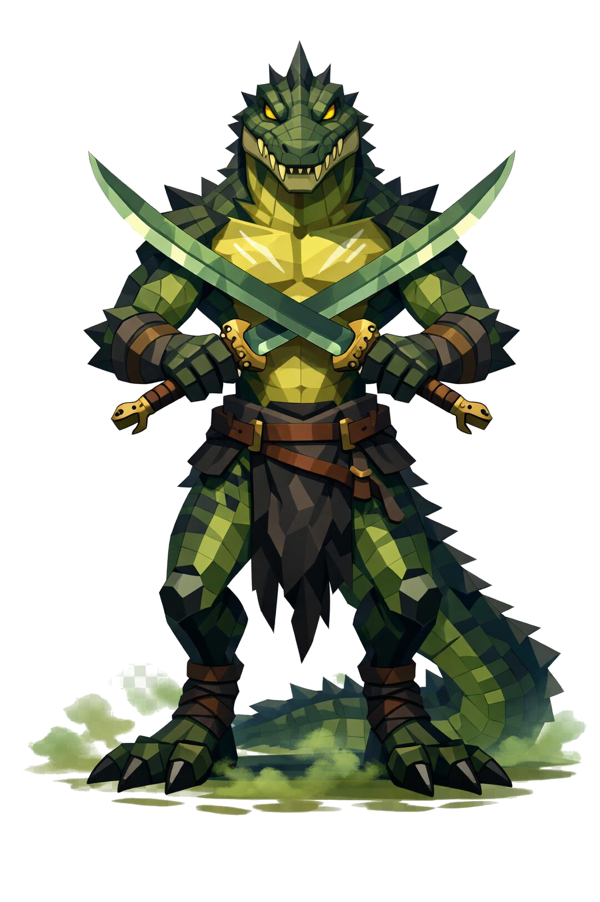

# Procodile, o Mestre da Lâmina

> *"Asteroth foi o único. Ninguém mais. Nem mesmo encostou."*

---

Procodile mede uns três metros de pé, mas ele raramente fica totalmente em pé. A postura é a de duelista: peso baixo, joelhos flexionados, espadas cruzadas em guarda à frente. Equilíbrio absoluto. Cada músculo onde precisa estar.

O focinho é de crocodilo. Alongado, largo, com fileiras de dentes amarelados e tortos sempre meio à mostra. Os olhos são verticais, dourados, pequenos, pupila em fenda fina. Do topo do crânio descem espinhos ósseos baixos pela nuca até o meio das costas, formando uma crista de jacaré sobre a coluna.

A pele é coberta por escamas grossas low poly. No dorso, verde-pântano profundo. Na barriga e no peito, transita pra amarelo-musgo. Pelos ombros, antebraços, panturrilhas e costas, placas ósseas maiores e mais escuras crescem como armadura natural. Manchas pretas espalhadas servem de camuflagem nas águas paradas.

O peito é descoberto, definido, marcado por cicatrizes velhas brancas atravessando a pele. Cada cicatriz é um duelo. No esterno, uma única cicatriz longa vertical é mais profunda que as outras, com bordas escurecidas. Aquela foi a única ferida séria que ele já sofreu. Ninguém sabe quem a deu. Os melhores apostam que foi Asteroth.

Os braços são longos, antebraços com placas ósseas externas. As mãos têm três garras pretas afiadas por dedo, mas seguram as espadas com elegância humana, não como bicho. Aprendeu lâmina. Não aprendeu por instinto.

As pernas são poderosas, joelhos invertidos. Os pés terminam em três dedos com garras pretas enormes. A cauda é longa e grossa, escamosa, com placas ósseas dorsais descendo até a ponta. Às vezes ele envolve a cauda na cintura como cinto vivo.

Veste só uma tanga de couro escuro com placas escamosas presas, e faixas de couro enroladas nos antebraços e nas panturrilhas. Sem armadura pesada. A pele já é armadura, e armadura pesada atrapalha o gesto.

As duas espadas são curvas, estilo katana de pântano. Lâminas de aço sujo com brilho esverdeado, manchadas de musgo seco, mas com fio cortante mostrando metal limpo brilhando. Os cabos são enrolados em couro de cobra, e os pomos têm cabeça de crocodilo em bronze. Uma das bainhas vazia presa nas costas, a outra na cintura.

Em volta dos pés dele, uma névoa esverdeada, sugestão de pântano. Folhas mortas flutuam em padrão giratório. Pegadas molhadas atrás. Em poça aos pés, uma pequena silhueta refletida que pisca antes da silhueta real piscar.

Ele te cumprimenta antes de matar. É o último gesto de respeito que você recebe.

---

*Sobre Procodile em [GOVERNANTES.md](../../../GOVERNANTES.md#procodile).*
