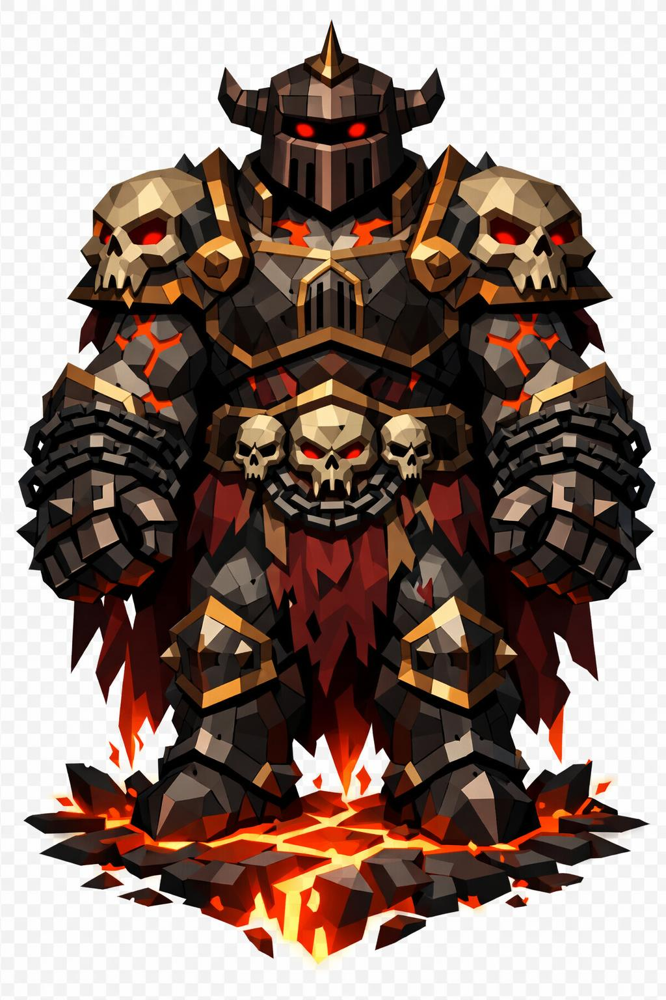

# Tartarus, o Executor do Abismo

> *"Ele não vem brigar. Ele vem buscar."*

---

Tartarus emerge do chão. A fissura abre primeiro, com lava vermelha escorrendo, e ele sobe. Oito metros visíveis, e ninguém viu o resto debaixo do solo. Frame colossal, ombros descomunalmente largos, peito imenso, braços tão grossos quanto o tronco de um humano comum. A postura é ereta e pesada como estátua de execução.

O elmo é massivo, estilo carrasco gladiador, em ferro enegrecido, com fenda horizontal estreita no visor. Sem rosto visível, só escuridão dentro. Dos lados do elmo, dois chifres curtos pretos torcidos saem. No topo, espinhos pontudos formam uma crista.

Dentro do visor, duas brasas vermelho-sangue brilham. Sem pupila, apenas brasa intensa. É o suficiente pra você saber que ele está te olhando.

O pescoço, ombros e mãos mostram a pele dele: cinza-pétrea rachada com veios de magma vermelho-laranja correndo nas fissuras. Não é fogo solar como o de Abaron. É fogo infernal, mais escuro, mais lento, mais punitivo.

A armadura é completa, estilo gladiador romano colossal, em ferro escuro enferrujado, com placas de ouro escuro sujo rebordando as bordas. As ombreiras são gigantes, em formato de caveiras, uma de cada lado, com olhos vermelhos brilhando. O peitoral massivo tem gravura central de um portão fechado, o portão do abismo, cravejado com espinhos pretos. Na cintura, um cinturão de placas de aço com caveiras menores penduradas.

Sobre os ombros, uma capa rasgada vermelho-sangue escuro cai pra trás, esfarrapada nas pontas, queimada em alguns lugares.

Os antebraços estão envoltos em correntes pesadas de ferro negro, várias voltas, com algumas correntes pendurando soltas. Algumas terminam em ganchos enferrujados, outras em algemas abertas. Os punhos são enormes, em manoplas de ferro com cravos pretos. As mãos têm garras pretas saindo das aberturas.

Nas pernas, placas pesadas, greavas enormes com cravos, botas de ferro terminando em pontas reforçadas. Marca de fogo aonde pisa.

Sobre o ombro ele carrega uma corrente gigantesca como cobra de metal, cada elo enorme, terminando em bola de ferro descomunal cravejada de espinhos. Maça de execução. A corrente brilha em veios vermelhos como se aquecida internamente.

Atrás dele, em silhueta menor, almas vermelhas presas, traidores acorrentados simbolicamente em algemas vermelhas brilhantes, flutuando sem corpo. São os que ele veio buscar. Você é só intermediário.

Ele não fala. Não precisa. A presença é o anúncio.

---

*Sobre Tartarus em [GOVERNANTES.md](../../../GOVERNANTES.md#tartarus).*
