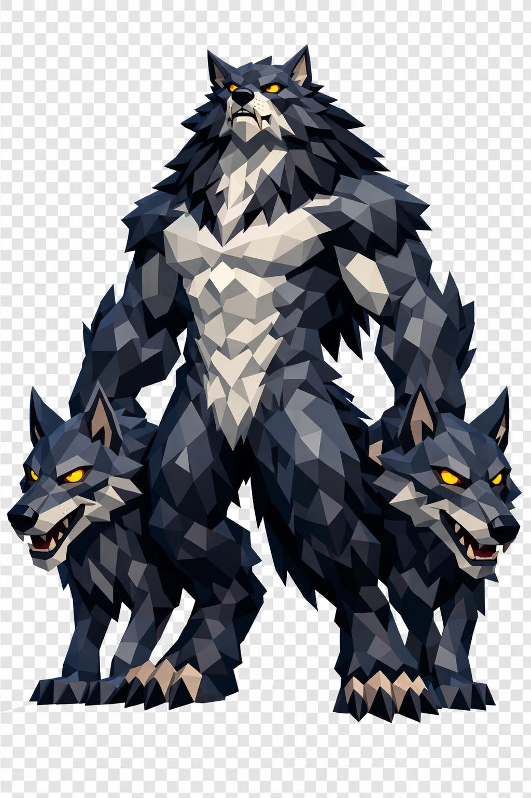

# Urien, o Senhor dos Lobos

> *"A matilha vem na frente. Ele vem quando você já entendeu que não vai escapar."*

---

Urien é grande. Três metros e meio, frame massivo e musculoso, peito profundo, ombros largos, braços poderosos, pernas curtas mas fortes com joelhos invertidos. Postura de alfa: quase ereto, um pouco curvado pra frente como animal alerta. Sempre tem pelo menos dois lobos ao lado dele.

A cabeça é de lobo. Alongada, focinho longo com narinas largas pretas, mandíbula entreaberta mostrando presas brancas afiadas de cada lado, lábios pretos. Orelhas pontudas eretas, atentas. Pelagem facial curta. Uma cicatriz atravessa o focinho dele em diagonal, antiga.

Os olhos são âmbar dourado intenso, brilhando levemente, pupila vertical fina. Olhar penetrante de predador inteligente. Não é só lobo. É lobo que pensa.

O corpo todo é coberto por pelo grosso e selvagem. No dorso, cinza-aço escuro. No peito, garganta e barriga, prata clara. Manchas pretas mais densas ao longo da coluna, ombros e antebraços. Na nuca e nos ombros, pelagem mais comprida formando uma juba grossa. Símbolo de alfa.

A musculatura é visível sob a pelagem. Cicatrizes velhas brancas atravessam os flancos, sequelas de antigas disputas pela liderança da matilha.

Os braços são longos e poderosos, antebraços com pelagem mais escura. As mãos são meio-humanas, meio-lobo. Palma escura, dedos terminando em garras pretas curvas e longas. Conseguem segurar uma arma sem perder destreza.

As pernas são curtas e fortes, digitígradas, com patas de lobo e garras pretas. A cauda é longa e felpuda, cinza-escura com ponta preta, pendendo atrás na horizontal de animal calmo mas alerta.

Sobre os ombros, um manto curto de pele de urso cai pra trás, preso por broche de prata em formato de cabeça de lobo com olhos de granada vermelha. No pescoço, um colar de presas e garras, troféus de outros lobos derrotados. Nos antebraços, braçadeiras de couro escuro com runas tribais entalhadas. Na cintura, um cinto largo de couro com bolsas e um crânio pequeno de lobo pendurado.

Sobre o ombro, ele apoia um machado de duas mãos. A cabeça é em formato de presa de lobo gigante, prata-aço escuro, com runas tribais brilhando levemente em azul-frio. O cabo é longo, madeira escura envolto em couro e fios de cabelo trançado.

Ao redor dos pés, uma névoa baixa lembra floresta noturna. Folhas mortas flutuam. Atrás dele, na sombra, olhos amarelos brilham no escuro. Você não sabe quantos. Sempre são mais do que você espera.

Ao seu lado, dois lobos visíveis. Um cinza, um preto. Sentados, olhos âmbar acesos, presença subordinada mas perigosa. O resto da matilha não aparece. Não precisa. Já te cercaram.

---

*Sobre Urien em [GOVERNANTES.md](../../../GOVERNANTES.md#urien).*
