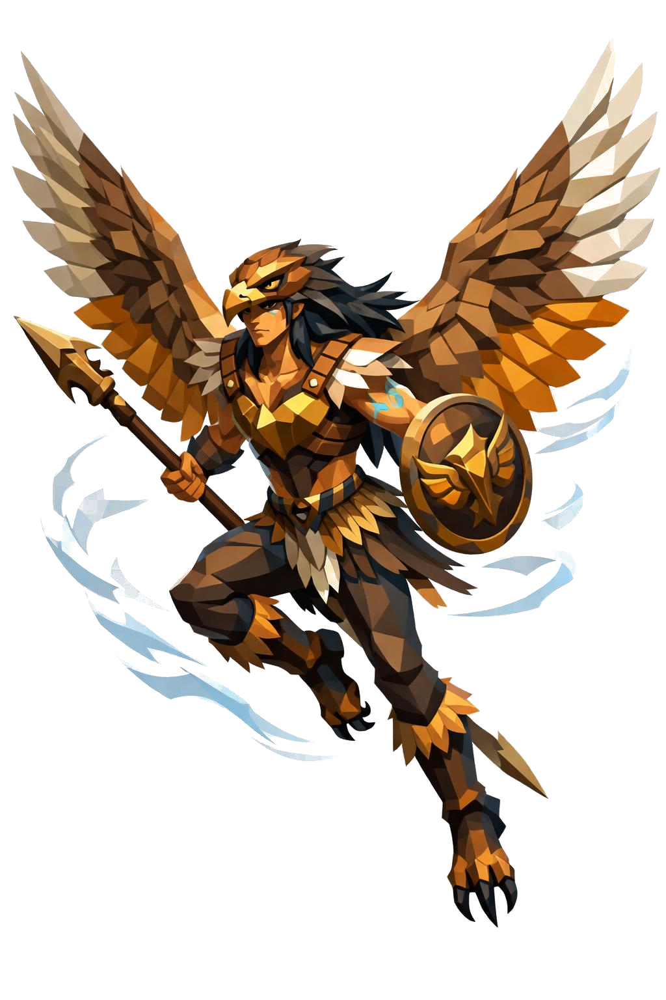

# Valkier, o Senhor dos Céus

> *"Você ouve as asas antes de ver. Quando vê, já é tarde."*

---

Valkier não pousa. Três metros de altura, físico atlético, ágil, com ombros largos e cintura fina. A pose é aerodinâmica, sempre inclinada pra frente, sempre com pelo menos uma asa começando a abrir. Quem o desenha em pé desenha errado.

O rosto é humano, mas afiado. Maçãs do rosto altas, queixo fino, traços de quem foi feito pra cortar o ar. Por cima do crânio, ele usa um capacete em formato de cabeça de águia, com bico curvo de bronze no topo descendo até a testa, e dois olhos de águia esculpidos nas laterais. Por trás do capacete, o cabelo longo preto escapa e voa pra cima como se cortado por um vento que só ele encontra.

Os olhos são âmbar dourado intenso, pupila vertical de ave de rapina. Foco predatório, sempre presente. Diz quem o encontrou que ele te identifica como presa em meio segundo, mesmo se você não for.

A pele é bronzeada clara. Os braços e o peito têm tatuagens em azul-céu pálido, raios e ventos estilizados, descendo pelos braços.

O peitoral é de couro marrom claro reforçado com placas de bronze polido facetadas, decoradas com motivos de penas. As ombreiras são pontiagudas, terminando em pontas de pena de metal afiadas.

Atrás das costas, duas asas gigantes de águia, totalmente abertas. Envergadura de uns oito metros, penas em geometria limpa low poly, marrom claro com pontas brancas e internas em âmbar dourado. Cada pena é uma faceta. Quando ele bate as asas, o ar parece se cortar antes da carne.

Os antebraços estão envoltos em braçadeiras de couro com penas presas. As mãos têm luvas curtas sem dedos. Calças de couro marrom claro justas, joelheiras de bronze, botas altas com garras de águia presas na ponta como se os próprios pés fossem talões.

Saindo da cintura nas costas, uma cauda curta de penas em leque, ajudando no equilíbrio em voo.

Numa mão, ele carrega uma lança longa de madeira clara facetada, com ponta em bronze afiada em formato de bico de águia. Na outra, um escudo redondo pequeno com gravura central de sol alado.

Atrás dele, o ar vira linhas. Pequenas penas soltas flutuam ao redor como caspa de vento. Eventualmente, uma águia menor circula perto, como se fosse o eco animal dele.

Onde criaturas aladas se reúnem em número, Valkier aparece. Não em terra. Sempre em diagonal, sempre vindo.

---

*Sobre Valkier em [GOVERNANTES.md](../../../GOVERNANTES.md#valkier).*
