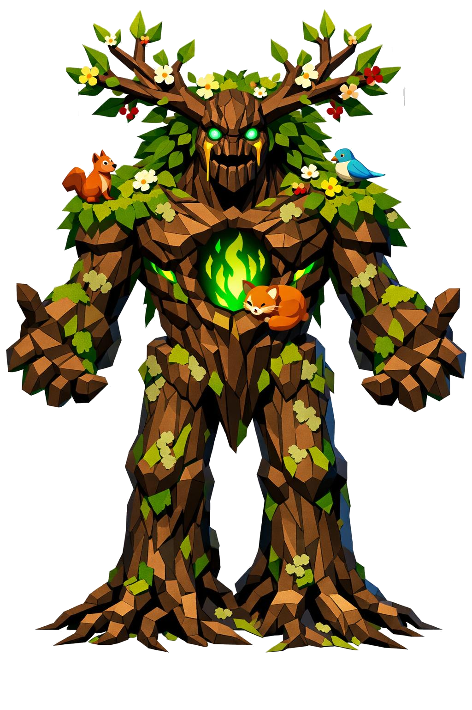

# Yemir, o Protetor da Natureza

> *"Ele não te odeia. Ele só não vê diferença entre você e o machado que você carrega."*

---

Yemir cresceu do chão. Doze metros de altura, frame humanoide colossal mas orgânico. Os ombros são largos, cobertos de musgo. O peito massivo lembra um tronco de árvore antigo. Os braços longos terminam em mãos como galhos retorcidos. As pernas são troncos de carvalho ancestrais, e raízes profundas saem dos pés se enterrando no solo. Não há separação clara entre perna e árvore. Ele literalmente nasce do chão.

A postura é firme, de guardião. Os braços abertos num gesto de proteção. Aos pés dele, sempre há animais.

A cabeça é esculpida em madeira escura, com fissuras formando os traços faciais: testa larga em casca grossa, olhos cavados, boca firme. Da cabeça crescem chifres ramificados, abertos pra cima como uma galhada ornamental, decorados com folhas verdes, flores brancas e amarelas, e pequenos frutos vermelhos. Cogumelos vermelhos pequenos crescem nas têmporas.

Os olhos são dois orbes verde-esmeralda profundos, sem pupila, brilhando com luz interna como gemas vivas. Lágrimas de seiva dourada escorrem lentamente.

A pele é casca de carvalho marrom-escura, facetada em low poly. Musgo verde brilhante cresce nos ombros, antebraços, peito e coxas. Entre as fendas da casca, veias internas de luz verde-clara brilham como seiva mágica pulsante. Líquens pálidos marcam as articulações.

Da nuca pelos ombros e descendo pelas costas, folhagem densa cresce como cabelo verde-vivo, salpicada de flores brancas, amarelas e violetas. Borboletas low poly azuis pousam aleatoriamente.

No centro do peito, na casca, uma cavidade se abre. Dentro dela, uma chama verde brilha: o coração da natureza. Sobre o ombro dele, descansando, um esquilo. No peito, um pequeno pássaro. Aos pés, um lobo de musgo, um cervo jovem com galhada de cristal verde, um urso pequeno coberto de líquens. Tudo dele.

Os braços têm veias de raízes subindo dos cotovelos pros ombros. As mãos são galhos retorcidos, dedos longos como ramos, pontas terminando em brotos verdes vivos. Antebraços envoltos por cipós trançados com pequenas flores.

Na mão direita, um cajado massivo: tronco torcido vivo, com uma esfera de cristal verde no topo, dentro da qual uma pequena floresta miniatura parece existir. Cipós vivos enrolados pelo cajado, com flores brancas abrindo.

Em volta dele, vento próprio mexe as folhas. Pétalas caem em câmera lenta, em branco, amarelo e violeta. Pequenos vagalumes verdes orbitam o corpo. Borboletas low poly voam ao redor. Chuva fina cai apenas ao redor dele, gotas low poly translúcidas descendo do nada.

A ira dele é a vegetação acelerando. Em segundos, ela cobre você. Em minutos, você é solo de novo.

---

*Sobre Yemir em [GOVERNANTES.md](../../../GOVERNANTES.md#yemir).*
