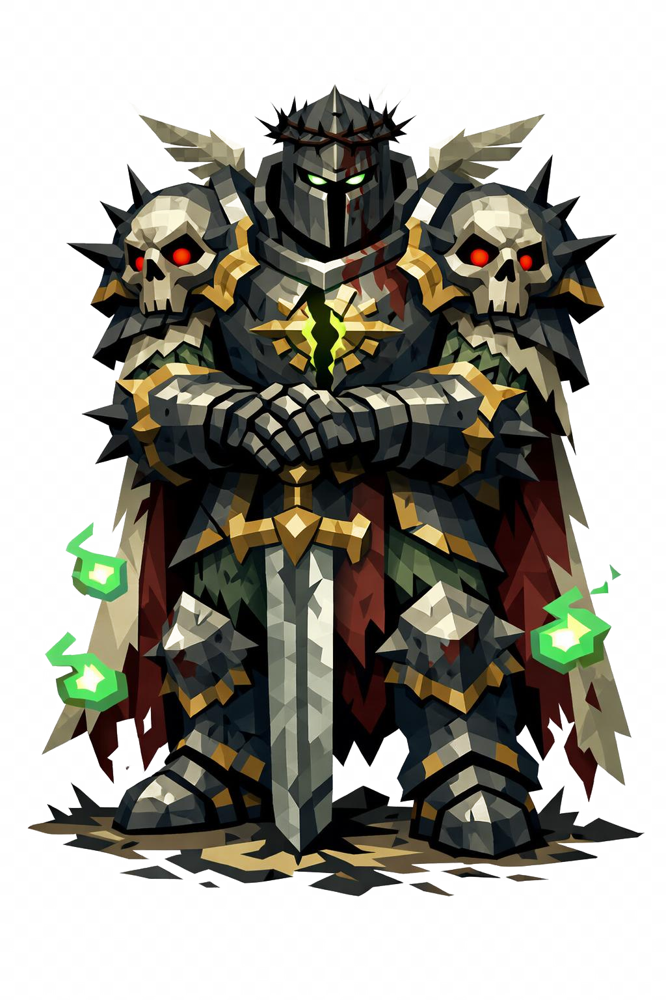

# Zaniel, o Paladino Corrompido

> *"Ele ainda saúda no início do combate. É costume velho. Não te salva."*

---

Zaniel já foi paladino. Hoje é um. A diferença é que ele não está mais vivo. Três metros e meio de altura, frame massivo dentro da armadura, ombros gigantescos, braços grossos. A postura ainda é ereta, de cavaleiro veterano. As duas mãos no cabo de um espadão imenso, ponta cravada no chão à frente. Honra residual mórbida.

O elmo é gótico, fechado, em prata embaçada e enegrecida. Ao redor dele, uma coroa de espinhos pretos. Pequenas asas estilizadas saem das laterais, resquício da insígnia divina antiga. O visor é uma fenda horizontal estreita, e dentro dela, no escuro, dois pontos brilhantes: duas chamas verde-fosforescentes, frias, sem pupila.

O elmo está cheio de rachaduras de batalha e manchas escuras de sangue seco. Não foi limpo.

A armadura é completa, estilo paladino, em prata-mítica antiga, opacada e enegrecida. Detalhes em ouro pálido contornam as bordas: símbolos solares estilizados nos ombros, peitoral com insígnia central de cruz luminosa, agora rachada ao meio, com luz verde-doente vazando da fenda. As ombreiras são enormes, terminando em espinhos pretos torcidos. Cotoveleiras e joelheiras têm cravos negros.

Pelos ombros cai uma capa longa rasgada. A parte externa é branca-sebenta amarelada, esfarrapada na barra. A parte interna é vermelho-vinho sangue seco. O símbolo solar grande bordado nas costas está rasgado ao meio.

Entre as juntas da armadura, a verdade vaza. O pulso esquerdo mostra pele cinza-esverdeada esfacelando. Os dedos esqueléticos aparecem parcialmente expostos. Quando ele move o pescoço, o maxilar inferior aparece um instante por baixo do visor, mostrando dentes amarelados.

As pernas têm botas grevadas de placas pesadas, esporas em prata enferrujada. Onde ele pisa, a terra morre. Em volta dos pés sempre há um leve círculo de terra escurecida.

Em torno dele, almas verdes etéreas flutuam, silhuetas humanas translúcidas em verde-fluorescente girando lentamente em órbita. Uma névoa cinza esverdeada sobe dos pés. Eventualmente, corvos pretos pequenos pousam nos ombros dele, silhuetas que parecem fazer parte da armadura.

A arma é um espadão necromântico. Claymore. Lâmina de prata escura com runas verdes brilhantes gravadas. Cabo cruciforme em ouro pálido sujo. Pomo em formato de caveira angelical: rosto de anjo com órbitas vazias. Sangue verde escorre da ponta da lâmina, devagar, mesmo quando ela está parada. Nas costas, preso, um escudo redondo grande com o símbolo solar rachado.

Zaniel saúda no primeiro encontro. É costume de paladino. Aceite a saudação. Depois corra. Não tente lutar. Você não conseguiu lutar com o paladino que ele era. Não vai conseguir lutar com o que ele virou.

---

*Sobre Zaniel em [GOVERNANTES.md](../../../GOVERNANTES.md#zaniel).*
