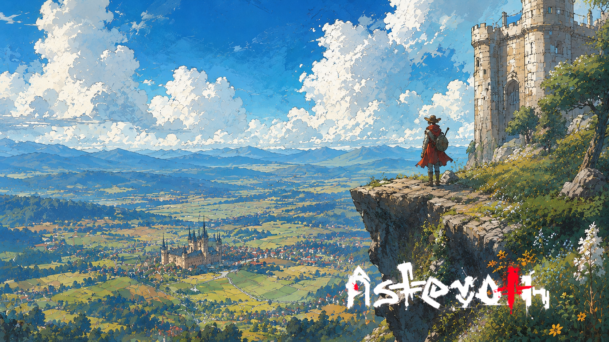

# O herdeiro do vale

> *Vale do Reno Branco · Era da Reconstrução · Verão.*

---

Aerin subiu a torre porque o pai havia subido antes dele, e o pai do pai antes do pai. A torre não pedia razão. Só pedia que alguém estivesse de pé no topo quando o sol abrisse o vale.

Lá embaixo, a cidade começava a respirar. Telhados de barro, fios de fumaça, o brilho fino do rio que o avô disse um dia ter cavado com as próprias mãos — mentira, claro. O rio sempre esteve ali. Foi o avô que veio depois.

Aerin contou as torres da cidade distante. Sete, como deveriam ser. Olhou as montanhas no horizonte. Estavam onde deveriam estar. Olhou o céu. Uma só nuvem alta, sem pressa.

Estava tudo no lugar. Por enquanto.

Ele encostou a mão na pedra quente da torre, e pensou no que o pai dizia: *cuide do vale, mas não confunda cuidar com possuir. O vale não é teu. Você é dele.*

O vento mudou. Aerin não soube por quê.

---

*Sobre a [Era da Reconstrução](../../LORE.md#a-civilizacao-que-vem).*
