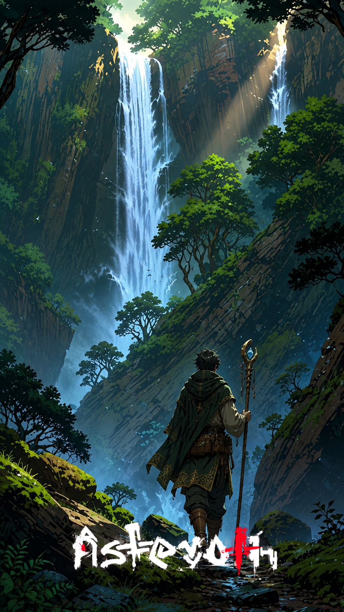

# A cachoeira que escuta

> *Floresta Submersa · Era da Reconstrução · Estação das Chuvas.*

---

Mireth chegou à cachoeira no terceiro dia sem dormir. O cajado pesava o triplo do que devia pesar, e a chuva que caía de cima parecia, às vezes, cair de baixo. Era o tipo de detalhe que ninguém em sã consciência menciona em voz alta.

Disseram a ela, na vila, que ninguém volta da Floresta Submersa contando o que viu. Disseram também que era preciso falar com a cachoeira em voz alta, no idioma antigo, e esperar. Mireth não conhecia o idioma antigo. Falou no idioma novo. — *Estou aqui.*

A água continuou caindo. Por um instante longo, ela achou que tinha errado o lugar, o ritual, a vida inteira. Então o ruído da queda d'água engrossou — engrossou como se uma garganta gigantesca tivesse decidido cantarolar abaixo das pedras — e Mireth entendeu que a cachoeira tinha ouvido.

Não soube se estava grata ou se devia correr.

---

*Sobre os [governantes que escutam antes de despertar](../../GOVERNANTES.md).*
