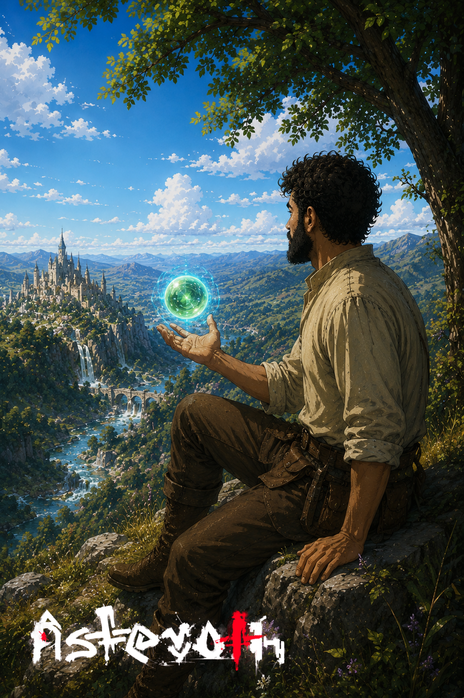

# A esfera nas mãos

> *Colina sobre Velvire · Era da Reconstrução · Outono.*

---

Doran encontrou a esfera embaixo de uma raiz, no terceiro dia de escavar o pé da colina. Não estava enterrada. Estava esperando. Quando ele tocou, a luz dela engrossou — verde, fria, viva — e por dois segundos Doran ouviu o nome de cada pessoa que algum dia caminhou por aquele vale, em ordem cronológica, do mais antigo ao mais recente.

Depois, silêncio. A esfera pulsava devagar, como se respirasse. Ele a levou para a colina e sentou sob a árvore — porque sentar foi a única coisa que fez sentido.

Lá em baixo, Velvire continuava existindo. Os sinos da catedral marcavam o meio-dia. Os mercadores discutiam o preço do trigo. Ninguém olhou para cima. Ninguém percebeu que, naquela tarde, um homem na encosta segurava o suficiente para saber tudo — e o suficiente para que a coisa que dorme dentro do planeta começasse a sonhar com ele.

Doran abriu os dedos. A esfera continuou flutuando. *Pertenço a você?* — ele perguntou. A luz piscou uma vez. Não era um sim.

---

*Sobre a [partícula](../../LORE.md#o-inicio--a-hora-das-particulas).*
