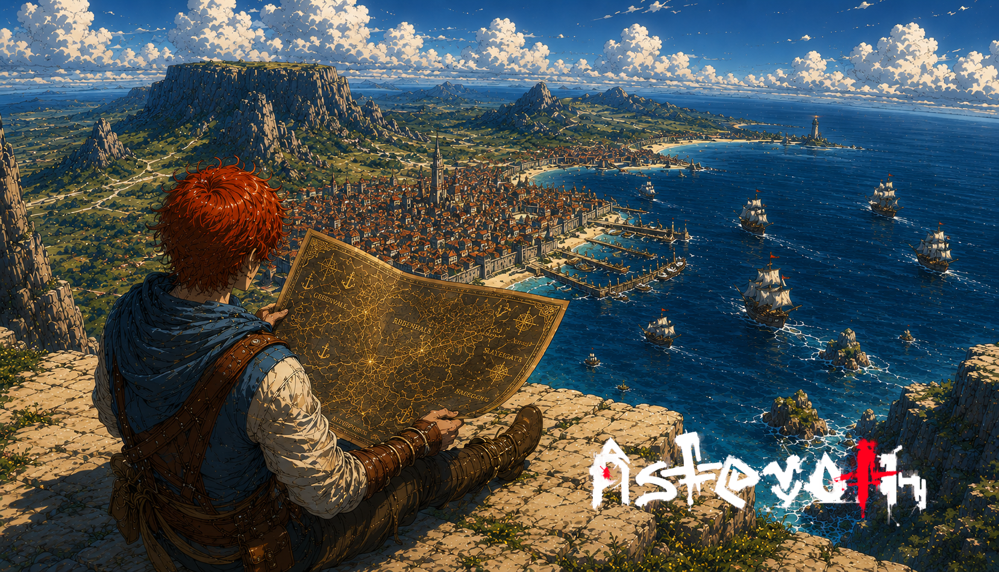

# A cartógrafa da Cidadela

> *Penhasco sobre o Porto da Cidadela · Era da Reconstrução · Final de Verão.*

---

Lilian subiu o penhasco antes do sol bater no porto. Trouxe a prancheta de cedro, três bicos de pena, dois tinteiros (preto e sépia), uma caixa de carvões finos, um vidro com larvas que tinha pegado no riacho na véspera, dois cogumelos não identificados, e fome.

Quando o conselho da Cidadela perguntou que classe ela escolhia, Lilian respondeu sem hesitar: Cartógrafa. Foi a única da turma daquele ano. Cartógrafa é classe aventureira, e as mães achavam estranho, e aventureiros desaparecem, e quem desaparece deixa as mães desaparecidas dentro de casa. Lilian não desapareceu. Lilian subiu o penhasco.

Página um do caderno: o porto. Quatro fragatas, sete saveiros, um cargueiro pesado. As docas se estendiam por quase uma légua, mais que no mapa do mês passado. Mercado de pedra novo, fileiras de telhados se confundindo até onde a vista alcançava, casas escalando o morro pelo lado leste. Lilian desenhou tudo em sépia, traço por traço, e marcou as docas novas com um X.

Página dois: a floresta a oeste, onde o porto morria e o verde começava. Lilian já conhecia três das árvores ali. Hoje arquivou a quarta. Tronco azul-cinza, folhas em leque, fruta que ela ainda não tinha visto cair. Anotou na margem, em letra firme: *aguardar queda. ou subir.*

Página três: minerais. Um veio fino, exposto na pedra onde os pés estavam apoiados, cor de cobre mas mais leve que cobre. Raspou uma lasca com a unha, embrulhou em pano, etiquetou.

Página quatro: o que voou enquanto ela desenhava. Um pássaro grande de bico curvo. Três passarinhos vermelhos. Uma coisa que ela jurava ser uma libélula, mas era do tamanho de uma mão aberta. Desenhou os quatro.

Quando o sol chegou ao meio do céu, Lilian já tinha doze páginas, três frutas embrulhadas, uma lasca de mineral sem nome, e uma sensação que outros chamariam de cansaço e ela chamava de combustível.

Em outros cinquenta anos, alguém faria o mesmo caminho com um caderno parecido. Ia desenhar uma cidade que ainda não existia, uma floresta que tinha mudado de cara, e a quarta árvore dela já com nome próprio.

Lilian esperava só que houvesse um penhasco onde sentar.

---

*Sobre o [mundo que cresce sem moldes prévios](../../LORE.md#a-civilizacao-que-vem) e [as classes](../../GAMEPLAY.md#classes).*
