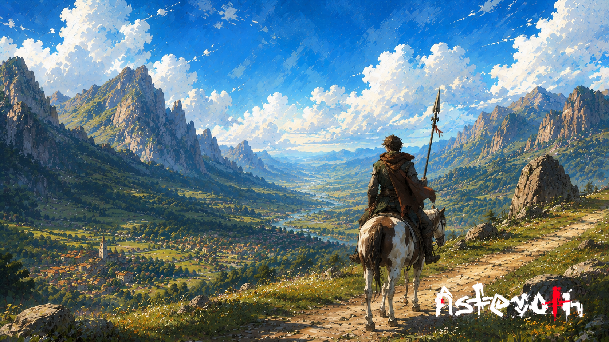

# O mensageiro do desfiladeiro

> *Desfiladeiro de Idro · Era da Reconstrução · Primavera tardia.*

---

Karel cruzou a crista ao meio-dia. A lança nas costas, o cavalo cansado, o vale aberto à frente como uma promessa lenta de água e descanso. Levava um lacre de cera vermelha no bolso interno do gibão. Não sabia o que dizia o lacre. Quem leva mensagem não pergunta.

O contrato era simples: três dias para atravessar o desfiladeiro, do forte do norte ao reino do sul. Sem parar em vilarejo, sem aceitar carona, sem responder a quem pedisse o nome. Mensageiros que respondem viram histórias. Histórias chegam tarde, ou não chegam.

No segundo dia, viu fumaça subindo de uma fenda na encosta — fumaça vermelha, fina, que não era de fogueira humana. Karel virou o rosto. Não viu, não conta, não acontece. Tocou o flanco do cavalo e seguiu.

À noite, sonhou com uma voz perguntando seu nome. Acordou antes de responder.

No terceiro dia, entregou o lacre. O homem do sul leu, dobrou, queimou. — *Volta amanhã. Pode haver outra.* Karel concordou. Já estava planejando uma rota diferente. O desfiladeiro não cobra duas vezes pelo mesmo silêncio.

---

*Sobre os [caminhos entre reinos](../../LORE.md#a-civilizacao-que-vem).*
