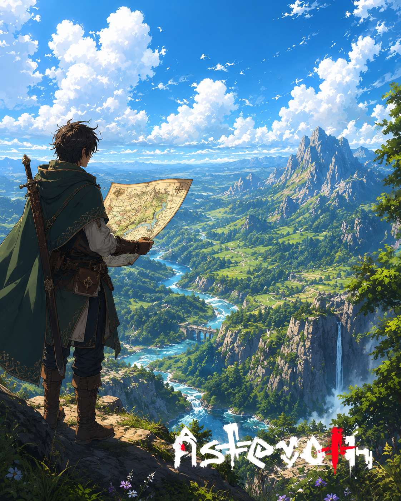

# O mapa que não fecha

> *Penhasco sem nome, três dias a leste de Holver · Era da Reconstrução · Inverno seco.*

---

Ielan ficou em pé na borda comparando o pergaminho com a paisagem, e a paisagem não cooperava. O rio existia. O penhasco existia. A montanha pontiaguda no horizonte existia. Mas a cachoeira à direita — a que despencava em três fios de prata pela face de pedra — não estava no mapa. Não em nenhum mapa que ele tinha encontrado, e ele tinha procurado em três cidades.

Quer dizer: ou alguém estava errado, ou a cachoeira era nova.

Ielan engoliu seco. Cachoeiras não nascem em três meses. Rios não muda de leito enquanto um homem dorme. Mas o planeta, segundo o que se conta em volta de fogueiras, lembra das coisas que humanos fazem dentro dele. E às vezes responde.

Ele dobrou o mapa devagar. Anotou no canto, com carvão: *Cachoeira tripla, lado leste, ainda viva.* Sublinhou *ainda*. Sublinhou duas vezes.

Depois desceu. Não voltou ao caminho de Holver. Foi pelo outro, mais longo, que evitava o rio.

---

*Sobre como o [terreno responde à presença humana](../../LORE.md#asteroth-o-filho-da-particula).*
