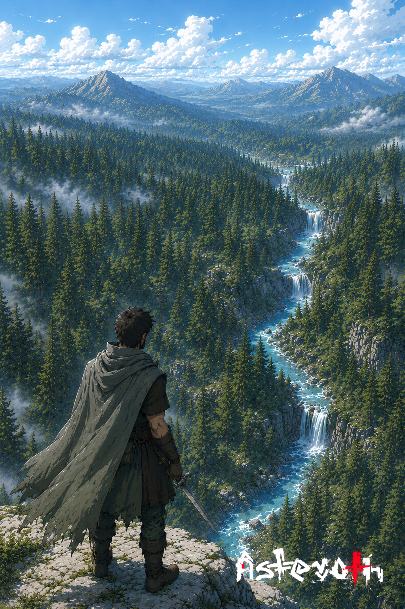

# Antes da descida

> *Crista do Vale Verde · Era da Reconstrução · Início do Outono.*

---

Havil parou na crista porque era a última crista. Daqui em diante, era floresta, pinheiros até onde a vista cansava, o rio enrolando entre eles como uma cobra de prata, e, em algum ponto que ele não conseguia ver mas sabia onde era, a clareira onde o irmão tinha morrido três anos antes.

Tinha vindo cobrar. Não estava certo de quem.

A floresta lá embaixo respirava. Havil sabia o que diziam dela: que andava com o vento, que mudava de lugar à noite, que devorava trilhas e cuspia outras. Os caçadores da região contornavam por meses só pra evitar atalhos. Mas Havil não era caçador. Era irmão. Irmão atravessa.

Ele desembainhou a espada e olhou pra lâmina. Estava limpa. Devia estar suja, depois de tudo. Mas era assim, o aço esquecia, e a memória ficava em quem a empunhava.

Havil guardou a espada. Começou a descer.

A floresta abriu uma trilha para ele. Não soube se era convite ou armadilha. Não fazia diferença.

---

*Sobre [o que vive nas florestas que respiram](../../GOVERNANTES.md).*
