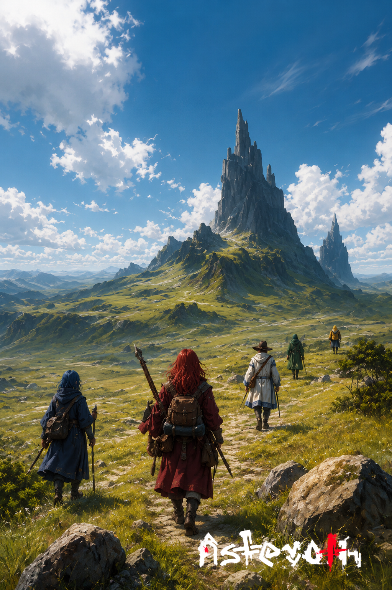

# A torre que cresceu sozinha

> *Planície de Korven · Era da Reconstrução · Verão.*

---

Eram quatro quando saíram de Korven. A maga azul à frente, porque era ela quem tinha visto a coisa em sonho. O arqueiro ruivo atrás, porque era o único que ainda confiava na maga azul. O clérigo de branco, contratado. O mercenário, na cauda, contratado mais ainda.

A torre não constava em mapa nenhum. Ninguém de Korven lembrava de ter visto montanha tão fina, com aquele pico de agulha e a base verde por uma fileira de pinheiros. Os pastores diziam que a montanha *cresceu* — palavra deles, não dos quatro — em algum momento da última primavera. Cresceu como cresce um cogumelo: ninguém viu, e de repente estava lá.

— *Não é montanha* — disse a maga azul, sem virar a cabeça. — *É torre.*

— *Torre é construída* — disse o arqueiro.

— *Eu sei.*

Ninguém falou pelos próximos dois quilômetros. O clérigo rezou baixo, em latim antigo. O mercenário começou a contar quanto valia recuar.

A torre, do alto do pico, esperou. Não tinha pressa. Já tinha esperado vinte mil anos. Quatro humanos a mais ou a menos não faziam diferença na cronologia.

---

*Sobre [estruturas que despertam](../../LORE.md#asteroth-o-filho-da-particula).*
