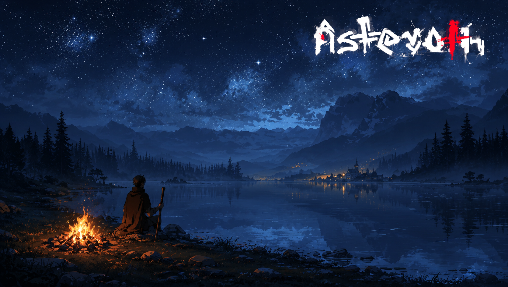

# O vigia da margem

> *Margem norte do Lago Idrhin · Era da Reconstrução · Final de Outono.*

---

Beren acendeu a fogueira pequena. Não era pra se aquecer. Era pra que vissem, do outro lado do lago, que alguém estava ali — e ninguém atravessasse esta noite.

A vila ficava na margem oposta. Telhados baixos, três janelas iluminadas, uma quarta que piscava como se alguém andasse de candeeiro entre cômodos. Beren conhecia o nome de cada habitante. Tinha nascido lá. Tinha jurado, ao sair, que voltaria. Tinha cumprido, à sua maneira.

Ele segurava um bastão de andarilho — sem corte, sem ponta. Não vinha pra brigar. Vinha pra contar.

No bolso, a carta dobrada três vezes. A letra do irmão dele, escrita à pressa, com tinta de outra cidade. Beren tinha decorado as palavras durante a travessia: *O Conselho votou ontem. Não te perdoaram. Não digas que vens. Diz só que passas, e segue.*

Beren olhou as estrelas — o céu naquela noite estava limpo, e dava pra ver a Via dos Antigos do começo ao fim. Pensou em atravessar mesmo assim. Pensou em virar a beira e voltar pelo caminho que tinha vindo.

Atiçou o fogo. Mais um galho. Ia decidir antes do amanhecer.

---

*Sobre [a fama que segue um nome](../../GAMEPLAY.md).*
