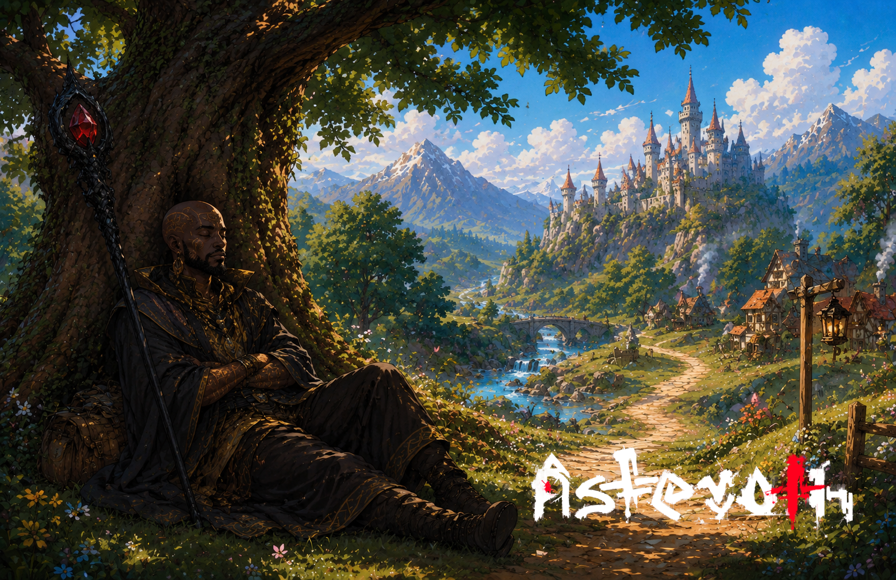

# O monge que parou de andar

> *Estrada de Galmore, a uma légua de Velserrane · Era da Reconstrução · Primavera.*

---

O irmão Yossen andou trinta e dois anos. Doze cidades, sete estradas que ele mesmo ajudou a abrir com a sola dos pés, três pestes, uma guerra que terminou antes de começar. Carregou o cajado de pedra vermelha o tempo todo. A pedra era o que sobrava, dizia ele, da fogueira de um irmão da ordem que tinha se entregado à floresta — e Yossen não sabia se era literal ou metafórico, e tinha decidido não perguntar.

Naquela manhã, ele se sentou debaixo da figueira no alto da curva — Velserrane à vista, com seus torreões dourados ao sol, o rio prateado costurando os campos, o vento descendo da montanha como se trouxesse recado.

E não levantou.

Não era cansaço. Era outra coisa. Era a sensação, súbita e total, de que o caminho tinha terminado — não a estrada, não a viagem, mas o *motivo*. O monge respirou fundo, encostou o cajado contra o tronco da figueira, fechou os olhos.

Um viajante passou no fim da tarde, perguntou se ele precisava de água. Yossen sorriu, disse que não, e perguntou se a árvore tinha nome.

O viajante respondeu que não sabia.

— *Então — disse o monge — vou ficar e dar um.*

---

*Sobre [os pequenos santuários que humanos criam ao caminhar](../../LORE.md#a-civilizacao-que-vem).*
