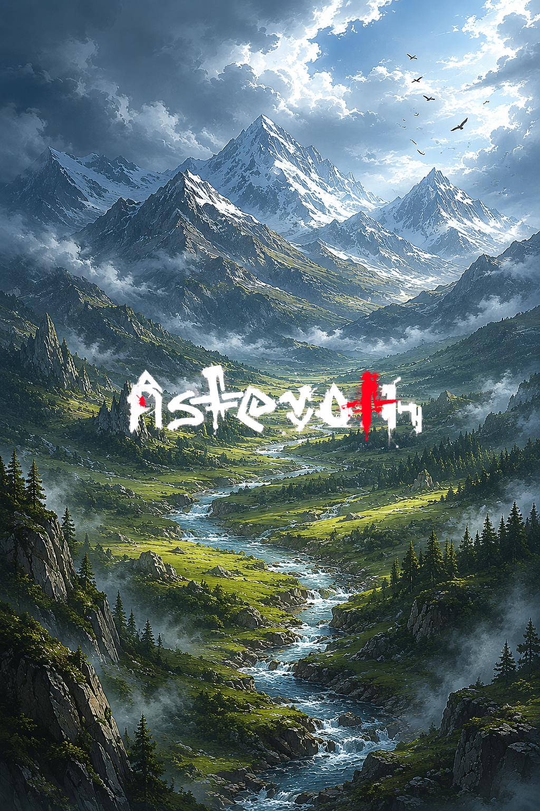

# O vale sem nome

> *Cordilheira do Norte Profundo · Era da Reconstrução · Antes de qualquer trilha.*

---

O vale não tinha nome porque ainda não tinha sido visto. Não por um humano. Não por essa geração, não por nenhuma das duas anteriores. A última vez que pé humano pisou ali, ainda era a outra era — a era cujo fim Asteroth empurrou com a mão aberta.

A montanha estava ali. O riacho estava ali. A grama crescia onde antes havia caminhos largos e telhados de pedra. Tudo tinha sido devolvido ao verde. Tudo tinha sido devolvido ao silêncio.

Por enquanto.

Em algum lugar a três dias de marcha — ainda do outro lado da última crista — um grupo de quatro andarilhos discutia se valia seguir ou voltar. Estavam discutindo havia dois dias. Os mantimentos diziam *volte.* A curiosidade dizia *siga.* O mais velho do grupo, que tinha enterrado o irmão na expedição anterior, dizia nada.

O vale esperava. Não tinha pressa.

Quando os quatro chegassem — se chegassem — alguém teria que decidir o nome. Era assim que o mundo crescia. Alguém via, alguém nomeava, alguém contava. O resto vinha depois: as cabanas, o lenhador, o moinho, a primeira aldeia, o primeiro saqueador, a primeira história.

Por enquanto, o vale era só o vale. E era o suficiente.

---

*Sobre [o terreno antes da civilização que vem](../../LORE.md#a-civilizacao-que-vem).*
