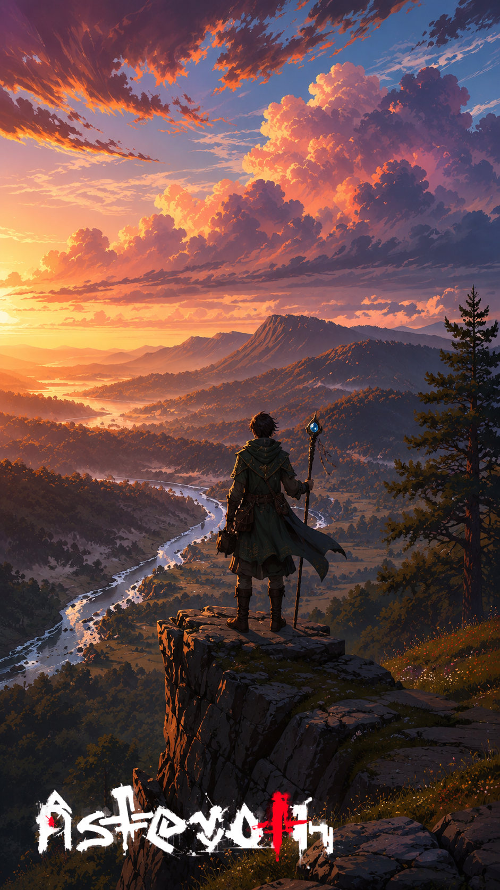

# O último entardecer

> *Penhasco de Saren · Era da Reconstrução · Equinócio.*

---

Lior chegou ao penhasco quando o sol já estava metade no rio e metade no morro de Saren. O cajado pendia na mão como se também estivesse cansado. Havia caminhado quatro dias para chegar ali, quatro dias com pouca conversa, com menos comida, com nenhuma intenção de chegar a outro lugar depois.

Era o entardecer prometido. Não pra ele. Pra quem viesse depois.

Em algum momento da noite seguinte, conforme o que tinha sido escrito num pergaminho que Lior carregava enrolado dentro do cinto, as duas luas se alinhariam, pela primeira vez em sessenta e três anos, com o ponto exato do céu onde a Via dos Antigos cruza o horizonte do oeste. Quem estivesse no penhasco veria. Quem visse, contaria. Quem contasse, escreveria. Quem escrevesse, deixaria pro próximo que tivesse paciência de esperar mais sessenta e três anos.

Lior não tinha mais sessenta e três anos. Tinha esta noite.

Ele sentou. Cravou o cajado entre as pedras. Olhou as nuvens vermelhas se apagarem, uma de cada vez, até que sobrasse só o azul fundo do céu de Asteroth, e, daqui a pouco, as duas luas, a rápida e a lenta, vindo se encontrar.

"Eu estou vendo", ele disse, em voz alta., "Está escrito."

E ficou.

---

*Sobre [as duas luas e as conjunções raras](../../LORE.md#as-duas-luas).*
