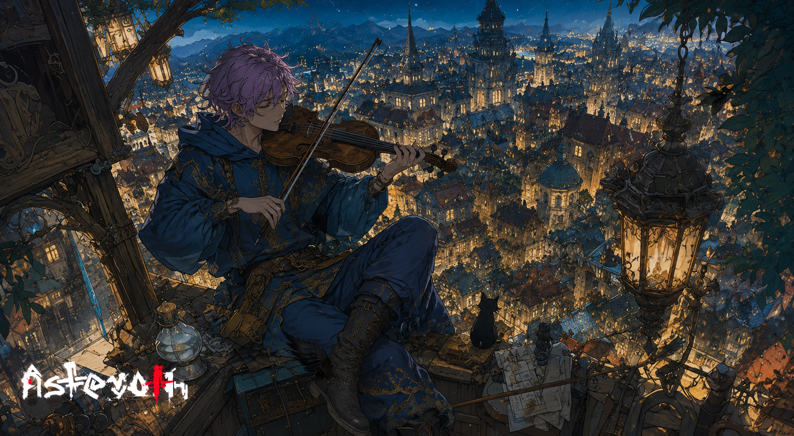

# O violino sobre os telhados

> *Telhado da Casa do Arco · Era da Reconstrução · Verão profundo.*

---

Naviel subia ao telhado todas as noites, depois que os sinos da terceira torre marcavam as onze. Levava o violino, o arco, o gato. O gato não tocava. O gato escutava.

Lá embaixo, a cidade, *Olverre, joia do leste, espinha torcida do continente*, se estendia como uma colcha de luzes amarelas, cada janela um pequeno fogo, cada beco uma sombra fria, e cada uma das vinte e nove torres erguendo seus pináculos contra o céu sem estrela visível, porque em Olverre nenhuma estrela aparece, a luz dos lampiões é forte demais.

Naviel tocava baixo. Não pra Olverre escutar. Olverre não escuta nada que não troque por moeda. Tocava pra si, pra ouvir a coisa lá dentro que insistia em existir, mesmo quando a cidade lá embaixo tramava nas mesas, lavrava contratos falsos, prendia gente errada, soltava gente pior.

Naquela noite, ele tocou uma melodia que não conhecia. Os dedos foram sozinhos. Quando terminou, o gato estava de pé, com os pelos eriçados, olhando pro leste, pra onde, três quarteirões adiante, na torre da catedral velha, uma luz se acendeu numa janela que ninguém abre há quarenta anos.

Naviel guardou o violino. Pegou o gato. Desceu sem olhar de novo.

Algumas melodias chamam coisas. E em Olverre, coisas atendem.

---

*Sobre [as cidades que crescem antes da vigilância](../../GOVERNANTES.md).*
