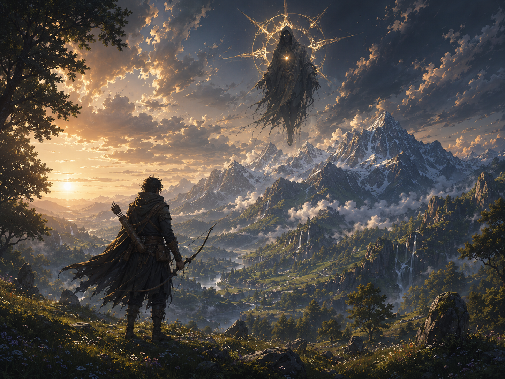

# A aparição sobre Mereon

> *Crista de Mereon · Era da Reconstrução · Outono.*

---

Hossen levou a flecha à corda mais por reflexo que por decisão. O corço magro a uns vinte passos abaixo parou de comer ao mesmo tempo, e ergueu a cabeça também. Não pra ele. Pro céu.

Levou um instante a mais que o corço pra entender o porquê.

No vão entre as duas cordilheiras, onde o sol caía sobre o vale como ouro derramado, havia uma figura suspensa. Encapuzada. Pés que não tocavam nada. As mangas do manto se desfaziam em raízes finas pra baixo, como se a carne dele lembrasse ainda de ter sido montanha. Atrás da cabeça, um halo de pontas, sete ou nove, de longe não dava pra contar com certeza, brilhando com a cor de coisa que existia antes de existir cor.

Hossen baixou o arco devagar.

Os mais velhos contavam, sem garantia nenhuma, que o rei do planeta dormia no leste, dentro do gelo, dentro da pedra. Que era espírito agora, sem corpo. Mas que, quando alguma coisa o despertava sequer um pouco, ele se mostrava onde podia, projetado fino como uma folha rasgada do sono, pra olhar.

Era isso. Hossen sabia. Sem ter visto antes, sabia.

Não bastava ter cuidado. Algo, em algum canto do mundo, tinha cruzado a linha. Talvez longe dali. Talvez perto. O olhar dele não estava nele, Hossen via, o olhar dele varria. Procurava algo no vale, no rio, no cume oposto. Não no caçador.

O corço fugiu. Hossen não atirou.

Por dois minutos, três no máximo, a figura ficou ali. Depois a luz do sol passou pelos pontos do halo como passa por um vitral, e o que estava no céu já não estava. Sobrou só o vale, o rio, e as nuvens vermelhas se apagando.

Hossen desarmou o arco. Sentou na pedra fria. Pensou em descer e contar. Sabia que ninguém na aldeia acreditaria, e que os que acreditassem, calariam.

Não era pra ele a aparição. Mas tinha sido ele que vira.

Guardou na boca o nome do que tinha estado no céu, e desceu sem dizer.

---

*Sobre [Asteroth](../../LORE.md#asteroth-o-filho-da-particula) e [seu sono em Nimue](../../LORE.md#mithril-e-as-montanhas-de-nimue).*
