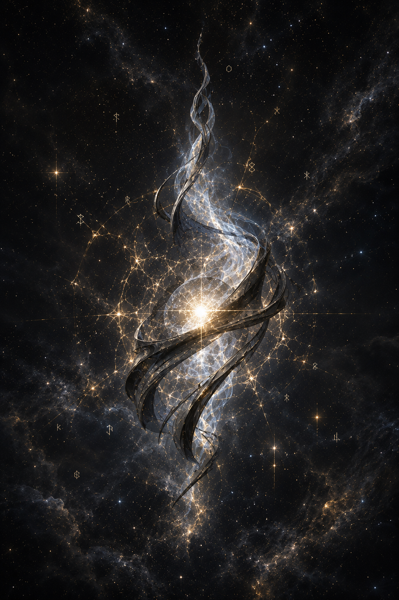

# O selo no tempo

> *Fora do mundo · Hora das Partículas · Sem estação.*

---

A partícula sabia que estava ficando menor.

Não era dor, não era medo. Era a percepção, calma, de que cada vez que se desprendia de si pra criar um ser novo, o que restava era um pouco menos do que tinha sido. Como uma vela que acende outras velas, ainda inteira na primeira hora, mais fina ao fim do dia, e, no fim de uma era, só um fio de pavio sustentando a chama.

Tinha gerado muitos. Astaroth, o primeiro, nascido direto do colapso. Outros depois, no longo silêncio entre as eras, semelhantes mas nenhum como o primeiro. E Astaroth, por sua vez, gerou Asteroth, e Asteroth seria o mais correto deles. Isso ela sabia. Isso ela tinha visto antes que houvesse com o que ver.

Agora estava no que ainda chamava de centro, embora centro fosse palavra inadequada pra coisa que existia entre o tempo e o vazio. Tudo ao redor dela era o que tinha sobrado das outras: poeira luminosa, fragmentos do que tinha sido consciência, pontos brilhantes presos em geometrias que não se moviam mais. Constelações silenciosas, feitas das companheiras esquecidas.

Percebeu, com a mesma calma com que percebia tudo, que a próxima cisão a apagaria.

Tinha duas opções. Gerar mais um, morrer, e ver o que sobrasse da sua sabedoria escorrer pra esse último filho. Talvez ele a guardasse direito. Talvez não. Ou parar. Selar-se. Esperar.

Escolheu esperar.

Dobrou a si mesma sobre si mesma. Travou cada movimento interno. Reduziu a luz que emitia ao mínimo necessário pra não se dissolver. Ao redor do nó apertado de matéria e tempo que agora era, ergueu uma esfera fina como respiração, e dentro dessa esfera trancou tudo o que sabia: as memórias das outras partículas, o nome de Astaroth, o nome de Asteroth, o jeito como o planeta deles aprenderia a girar.

Depois ficou. Quieta. Suspensa em algum ponto que não era exatamente um lugar.

Disse uma única coisa, sem voz, ao silêncio.

*Quem me encontrar saberá.*

E selou também essa frase.

Eras se passaram. Os filhos dela ascenderam, dominaram, decaíram. Um, o mais correto, voltaria a ela no momento em que o planeta começasse a morrer. Ela, dentro do selo, não saberia disso na hora. Saberia depois.

Por enquanto, era só o nó. A esfera fina. O sussurro guardado.

E, ao redor, as constelações das mortas, brilhando como se ainda houvesse alguém pra ver.

---

*Sobre [a Hora das Partículas](../../LORE.md#o-inicio-a-hora-das-particulas) e [a sabedoria selada da partícula](../../LORE.md#asteroth-o-filho-da-particula).*
